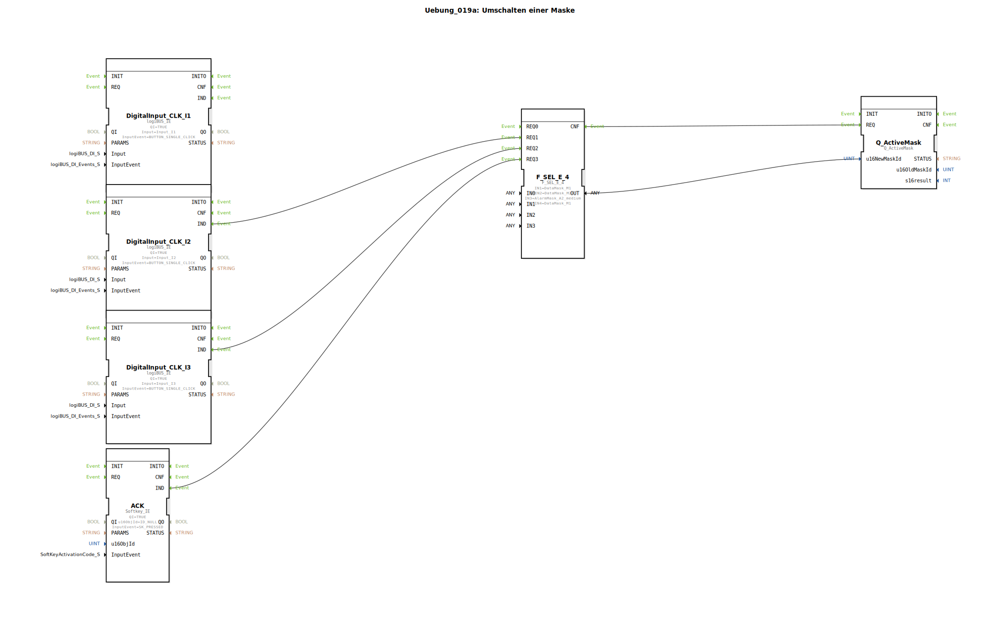

# Uebung_019a: Umschalten einer Maske

Dieser Artikel beschreibt die logiBUS®-Übung `Uebung_019a`. Hier wird die Maskenumschaltung um eine Sicherheitsfunktion erweitert: Den Alarm.

----

## Ziel der Übung

Erlernen des Umgangs mit Alarm-Masken. Im ISOBUS-Standard haben Alarme Vorrang vor normalen Datenmasken und können oft nur durch eine explizite Quittierung (ACK) verlassen werden.

-----

## Beschreibung und Komponenten

[cite_start]In `Uebung_019a.SUB` wird ein vierstufiger Selektor (`F_SEL_E_4`) zur Maskenwahl genutzt[cite: 1].

### Funktionsbausteine (FBs)

  * **`I1` & `I2`**: Normale Maskenwahl (M1, M2).
  * **`I3`**: Auslöser für den Alarm.
  * **`ACK`**: Ein Softkey am Terminal zum Quittieren des Alarms.
  * **`AlarmMask_A2_medium`**: Eine spezielle Alarm-Maske aus dem Pool.

-----

## Funktionsweise

1.  Durch `I1` und `I2` kann der Nutzer wie gewohnt navigieren.
2.  Tritt ein Fehler ein (`I3`), erzwingt die Steuerung die Anzeige der `AlarmMask_A2`. Das Terminal überlagert nun die aktuelle Ansicht mit der Alarmmeldung.
3.  Die Navigation über `I1/I2` ist nun wirkungslos oder wird vom Alarm überdeckt (je nach Terminal-Implementierung).
4.  Erst wenn der Nutzer am Terminal den Softkey **ACK** drückt, schaltet die Steuerung wieder auf die normale Arbeitsmaske (`M1`) zurück.

-----

## Anwendungsbeispiel

**Überlastwarnung**:
Ein Sensor meldet eine drohende Überlastung der Maschine. Die Steuerung unterbricht die normale Anzeige und blendet großformatig die Warnung "Überlast!" ein. Der Fahrer muss den Fehler bewusst wahrnehmen und am Terminal quittieren, bevor er die normalen Anzeigen wieder nutzen kann.