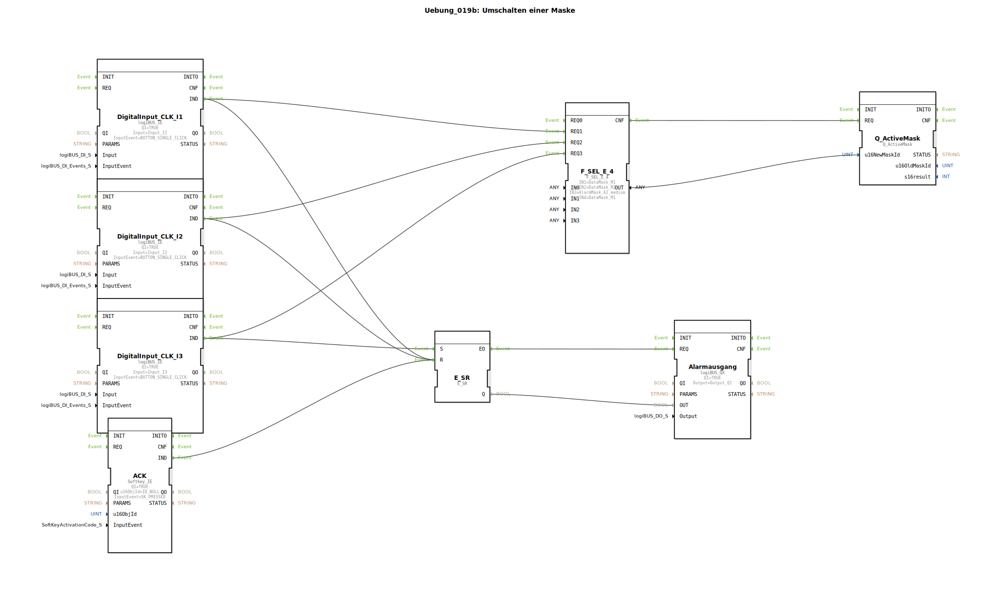

# Uebung_019b: Umschalten einer Maske

Dieser Artikel beschreibt die logiBUS®-Übung `Uebung_019b`. Hier wird der virtuelle Alarm am Terminal mit einem physischen Alarm-Ausgang synchronisiert.

----

## Ziel der Übung

Verknüpfung von UI-Zuständen mit Hardware-Speichern. Es soll sichergestellt werden, dass ein Alarmzustand in der Steuerung erhalten bleibt, bis er am Terminal gelöscht wird.

-----

## Beschreibung und Komponenten

[cite_start]In `Uebung_019b.SUB` wird zusätzlich zur Maskenumschaltung ein SR-Flip-Flop für den Alarm-Status verwendet[cite: 1].

### Funktionsbausteine (FBs)

  * **`E_SR`**: Der Alarm-Speicher.
  * **`Alarmausgang`**: Schaltet eine physische Hupe oder Warnlampe (`Q1`).

-----

## Funktionsweise

*   **Alarm auslösen**: Taster `I3` triggert den Alarm. Das Terminal springt auf die Alarmmaske **UND** der Speicher `E_SR` wird gesetzt ➡️ Die physische Hupe geht an.
*   **Quittieren**: Der Nutzer drückt **ACK** am Terminal. Die Steuerung wechselt zurück zur normalen Maske **UND** löscht den Speicher `E_SR.R` ➡️ Die Hupe verstummt.
*   Interessant: Auch das Wechseln zu einer anderen normalen Maske (`I1`, `I2`) löscht in dieser Implementierung den Alarm-Speicher (Reset-Zweig am `E_SR`).

-----

## Anwendungsbeispiel

**Zentrale Störmelde-Zentrale**:
Ein kritischer Fehler (z.B. Öldruckverlust) löst sowohl die Anzeige am Bildschirm als auch eine externe Sirene aus. Der Techniker muss zum Terminal gehen, um zu sehen, was los ist, und durch die Quittierung sowohl das Display aufräumen als auch den Lärm abstellen.