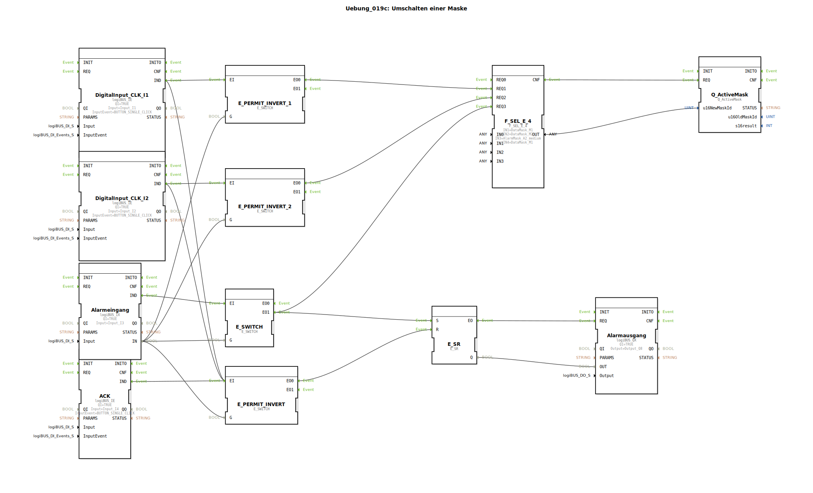

# Uebung_019c: Umschalten einer Maske

Dieser Artikel beschreibt die logiBUS®-Übung `Uebung_019c`. Dies ist die komplexeste Navigations-Logik, bei der die Maskenumschaltung aktiv vom Hardware-Zustand blockiert werden kann.

----

## Ziel der Übung

Implementierung einer bedingten Navigationssteuerung. Der Wechsel der Bildschirmseiten soll unterbunden werden, solange ein aktiver Alarm anliegt.

-----

## Beschreibung und Komponenten

[cite_start]Die Subapplikation `Uebung_019c.SUB` nutzt mehrere `E_SWITCH` Bausteine als "Türsteher" für die Ereignisse[cite: 1].

### Funktionsbausteine (FBs)

  * **`Alarmeingang`**: Ein physischer Sensor (`I3`). Solange dieser `TRUE` ist, herrscht Alarmzustand.
  * **`E_SWITCH` (diverse)**: Prüfen vor jeder Aktion, ob der Alarmeingang aktiv ist.
  * **`ACK`**: Ein physischer Quittier-Taster (`I4`) anstelle eines Softkeys.

-----

## Funktionsweise

Die Weichen blockieren die normalen Navigations-Befehle:
1.  Drückt der Nutzer `I1` (Maske 1), geht das Event zuerst an einen `E_SWITCH`.
2.  Die Weiche prüft den `Alarmeingang`.
    *   Ist **kein** Alarm vorhanden (`G=FALSE`), wird das Event zu `EO0` ➡️ `F_SEL_E_4` durchgelassen. Die Seite wechselt.
    *   Ist ein Alarm aktiv (`G=TRUE`), landet das Event bei `EO1` (nicht verbunden). Der Seitenwechsel wird **ignoriert**.
3.  Tritt ein Alarm ein, schaltet das System sofort auf die Alarmmaske und aktiviert die Hupe.
4.  Erst wenn der Alarm-Sensor (`I3`) wieder FALSE ist **UND** der Nutzer den Quittier-Taster (`I4`) drückt, wird der Speicher zurückgesetzt und die Navigation wieder freigegeben.

-----

## Anwendungsbeispiel

**Zwingende Störungsbehebung**:
Bei einem kritischen Hardware-Fehler (z.B. Not-Aus betätigt) darf der Bediener das Terminal nicht weiter zur normalen Maschinensteuerung nutzen. Er wird auf der Alarmseite "festgehalten", bis der Not-Aus entriegelt und die Störung quittiert wurde. Dies erzwingt die Aufmerksamkeit für das vorrangige Sicherheitsproblem.