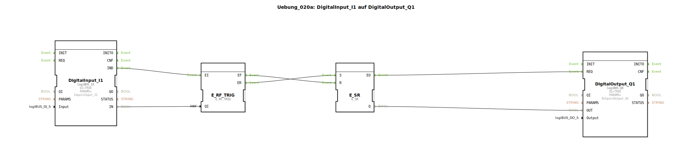

# Uebung_020a: DigitalInput_I1 auf DigitalOutput_Q1

Dieser Artikel beschreibt die logiBUS®-Übung `Uebung_020a`. Hier wird die manuelle Erzeugung von Setz- und Rücksetz-Ereignissen aus einem Standard-Datensignal demonstriert.

----

## Ziel der Übung

Verständnis der Flankenerkennung. Es wird gezeigt, wie man mit einer Ereignis-Weiche (`E_SWITCH`) und einem Speicher (`E_RS`) ein Verhalten realisiert, bei dem der Ausgang beim Drücken eines Tasters eingeschaltet und beim Loslassen ausgeschaltet wird (entspricht funktional einer direkten Leitung, aber mit expliziter Logik-Trennung).

-----

## Beschreibung und Komponenten

[cite_start]Die Subapplikation `Uebung_020a.SUB` nutzt einen `logiBUS_IX` Eingang, um einen `E_RS` Speicher zu steuern[cite: 1].

### Funktionsbausteine (FBs)

  * **`DigitalInput_I1`**: Standard-Eingang. Liefert ein Event bei jeder Änderung.
  * **`E_SWITCH`**: Leitet das Event je nach Pegel an `S` oder `R` weiter.
  * **`E_RS`**: Der Ereignis-Speicher.

-----

## Funktionsweise

1.  **Drücken (TRUE)**: Das `IND`-Event geht zur Weiche. Da `G=TRUE`, feuert `EO1` ➡️ `E_RS.S` (Setzen).
2.  **Loslassen (FALSE)**: Das `IND`-Event geht zur Weiche. Da `G=FALSE`, feuert `EO0` ➡️ `E_RS.R` (Rücksetzen).

Obwohl das Ergebnis eine 1:1 Abbildung des Eingangs ist, zeigt diese Übung den inneren Mechanismus von speichernden Systemen.