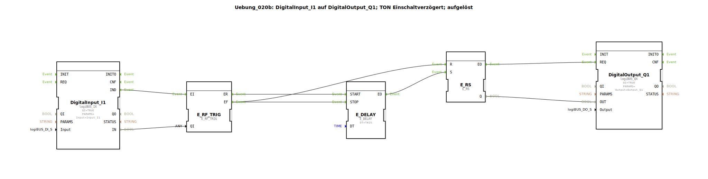

# Uebung_020b: DigitalInput_I1 auf DigitalOutput_Q1; TON Einschaltverzögert; aufgelöst

Dieser Artikel beschreibt die logiBUS®-Übung `Uebung_020b`. Hier wird eine Einschaltverzögerung (TON) manuell aus Grundbausteinen aufgebaut.

----

## Ziel der Übung

Verstehen der Zeitsteuerung durch Ereignisverzögerung (`E_DELAY`). Es wird gezeigt, wie ein Timer-Verhalten ("Licht geht erst nach 2 Sekunden an") durch das gezielte Verzögern und Abbrechen von Ereignissen realisiert wird.

-----

## Beschreibung und Komponenten

[cite_start]In `Uebung_020b.SUB` wird ein Verzögerungs-Baustein zwischen die Eingangs-Weiche und den Speicher geschaltet[cite: 1].

### Funktionsbausteine (FBs)

  * **`E_DELAY`**: Wartet die Zeit `DT` (2 Sekunden) ab.
  * **`E_SWITCH`**: Steuert den Start und Stopp des Timers.

-----

## Funktionsweise

1.  **Start**: Nutzer drückt `I1`. Die Weiche schaltet auf `EO1` ➡️ `E_DELAY.START`.
2.  **Warten**: Wenn der Nutzer den Taster für volle 2 Sekunden gedrückt hält, feuert `E_DELAY.EO` ➡️ `E_RS.S`. Die Lampe geht an.
3.  **Abbruch**: Lässt der Nutzer den Taster vor Ablauf der 2 Sekunden los, schaltet die Weiche auf `EO0`. Dieses Event triggert `E_DELAY.STOP` (Timer wird gelöscht) **und** `E_RS.R` (Ausgang wird sicher auf FALSE gesetzt).

Ergebnis: Einschaltverzögerung mit sofortigem Abbruch bei Signalverlust.