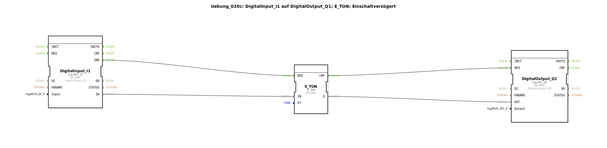

# Uebung_020c: DigitalInput_I1 auf DigitalOutput_Q1; E_TON; Einschaltverzögert

Dieser Artikel beschreibt die logiBUS®-Übung `Uebung_020c`.

----

## Ziel der Übung

Nutzung des standardisierten Timer-Bausteins `E_TON`.

-----

## Beschreibung und Komponenten

[cite_start]Die Subapplikation `Uebung_020c.SUB` nutzt den `E_TON` Baustein aus der Event-Timer-Bibliothek[cite: 1].

### Funktionsbausteine (FBs)

  * **`E_TON`**: Timer ON-Delay (Ereignisbasiert).
  * **Parameter `PT`**: Preset Time (hier 5 Sekunden).

-----

## Funktionsweise

Der Baustein vereinfacht den Aufbau aus Übung 020b erheblich:
*   Eingang `I1` wird TRUE ➡️ Timer startet.
*   Nach 5s wird der Ausgang `Q` TRUE.
*   Eingang `I1` wird FALSE ➡️ Timer bricht ab, Ausgang wird sofort FALSE.

Dies ist der Standardweg, um Verzögerungen in 4diac zu realisieren.