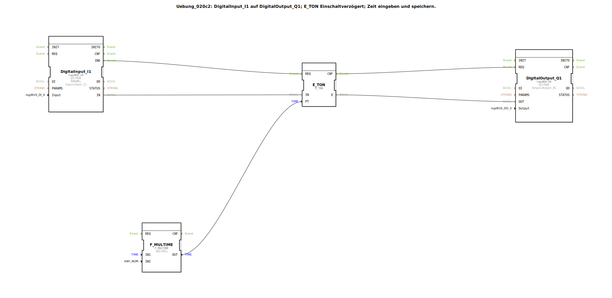

# Uebung_020c2: DigitalInput_I1 auf DigitalOutput_Q1; E_TON Einschaltverzögert; Zeit eingeben und speichern.

Dieser Artikel beschreibt die logiBUS®-Übung `Uebung_020c2`. Hier wird die Einschaltverzögerung mit einer Benutzereingabe am Terminal und Datenspeicherung kombiniert.

----

## Ziel der Übung

Dynamische Anpassung von Timer-Zeiten zur Laufzeit.

-----

## Beschreibung und Komponenten

[cite_start]In `Uebung_020c2.SUB` wird die Verzögerungszeit (`PT`) nicht fest im Programm hinterlegt, sondern vom ISOBUS-Terminal eingelesen[cite: 1].

### Funktionsbausteine (FBs)

  * **`Uebung_020c2_sub`**: Eine Speicher-SubApp (wie in Übung 012a), die den vom Nutzer eingegebenen Zahlenwert verwaltet.
  * **`F_MULTIME`**: Multipliziert einen Zeitwert. Hier wird der Zahlenwert (z.B. "5") mit der Einheit `T#1s` multipliziert, um den Datentyp `TIME` für den Timer zu erzeugen (z.B. 5 Sekunden).
  * **`E_TON`**: Der eigentliche Verzögerungs-Baustein.

-----

## Funktionsweise

1.  Der Nutzer gibt am Terminal eine "5" ein.
2.  Der Wert wird im NVS gespeichert und an die Logik übergeben.
3.  `F_MULTIME` macht daraus 5 Sekunden.
4.  Wird nun der physische Taster `I1` gedrückt, verzögert `E_TON` das Signal um exakt diese 5 Sekunden.

Ändert der Nutzer den Wert am Terminal auf "10", reagiert der Timer ab sofort mit 10 Sekunden Verzögerung.