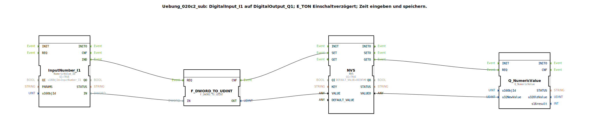

# Uebung_020c2_sub: DigitalInput_I1 auf DigitalOutput_Q1; E_TON Einschaltverzögert; Zeit eingeben und speichern.

## Übersicht

[cite_start]Dieser Sub-App-Typ ist eine spezialisierte Version von `Uebung_012a_sub`, optimiert für die Verwaltung von numerischen Zeitwerten am ISOBUS-Terminal[cite: 1]. Er übernimmt die komplette Logik von der Benutzereingabe über die stromausfallsichere Speicherung bis hin zur kontinuierlichen Bereitstellung des Werts für nachfolgende Zeitglieder (wie in Übung 020c2 gezeigt).

## 🛠️ Zugehörige Übungen

* [Uebung_020c2](Uebung_020c2.md)

