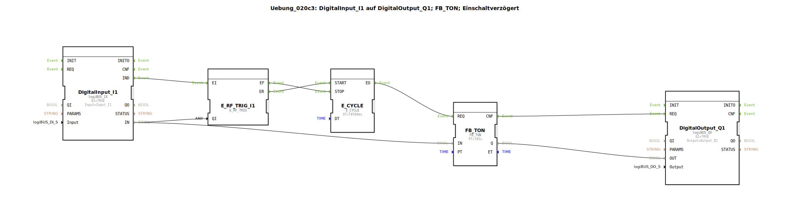

# Uebung_020c3: DigitalInput_I1 auf DigitalOutput_Q1; FB_TON; Einschaltverzögert

Dieser Artikel beschreibt die logiBUS®-Übung `Uebung_020c3`. Hier wird der klassische IEC 61131-3 Timer-Baustein `FB_TON` verwendet, der eine regelmäßige Triggerung (Takt) benötigt.

**Wichtiger Hinweis: Dieser Baustein funktioniert nur korrekt, wenn er zyklisch aufgerufen wird.**

----

## Ziel der Übung

Das Ziel ist es, eine Einschaltverzögerung mit einem klassischen SPS-Verhalten (inkl. ET-Ausgang) in einer ereignisbasierten Umgebung zu realisieren. Im Gegensatz zum ereignisbasierten `E_TON` benötigt der `FB_TON` einen regelmäßigen Trigger (Abtastung), um seine interne Zeitrechnung und den Ausgang `ET` zu aktualisieren.

-----

## Beschreibung und Komponenten

[cite_start]In `Uebung_020c3.SUB` wird ein Taktgeber verwendet, um den klassischen Timer anzutreiben[cite: 1].

### Funktionsbausteine (FBs)

  * **`FB_TON`**: Der klassische TON-Baustein.
  * **`E_CYCLE`**: Ein Zeitgeber, der alle 500ms ein Ereignis an den `REQ`-Eingang des Timers sendet.

-----

## Funktionsweise

Damit der `FB_TON` korrekt funktioniert, muss er "befragt" werden.
1.  Der Nutzer drückt Taster `I1`. Das Signal liegt am Dateneingang `IN` des Timers an.
2.  Gleichzeitig startet der Taster über eine Weiche den `E_CYCLE`.
3.  Alle 500ms fordert der Cycle den Timer zur Berechnung auf (`REQ`).
4.  Erst bei diesen Abfragen prüft der Timer, wie viel Zeit vergangen ist.
5.  Sobald die 5 Sekunden erreicht sind, wechselt der Ausgang `Q` auf TRUE.

Diese Methode ist notwendig, wenn man Bausteine aus der 61131-Welt in die 61499-Event-Welt integriert.