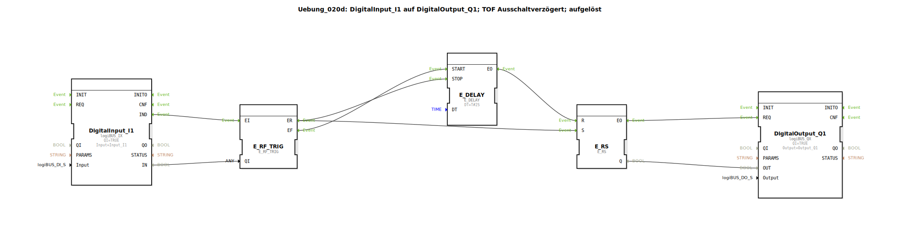

# Uebung_020d: DigitalInput_I1 auf DigitalOutput_Q1; TOF Ausschaltverzögert; aufgelöst

Dieser Artikel beschreibt die logiBUS®-Übung `Uebung_020d`. Hier wird die Funktion einer Ausschaltverzögerung (TOF) manuell aus Grundbausteinen aufgebaut.

----

## Ziel der Übung

Realisierung eines Nachlauf-Verhaltens. Der Ausgang soll beim Drücken des Tasters sofort angehen, aber nach dem Loslassen noch eine definierte Zeit (2 Sekunden) aktiv bleiben.

-----

## Beschreibung und Komponenten

[cite_start]In `Uebung_020d.SUB` wird die TOF-Logik durch geschickte Verknüpfung von `E_DELAY` und `E_RS` implementiert[cite: 1].

### Funktionsweise

1.  **Einschalten**: Nutzer drückt `I1`. Die Weiche leitet das Event an `EO1`. Dies bewirkt zwei Dinge:
    *   Der Speicher `E_RS` wird sofort gesetzt (Lampe geht an).
    *   Ein eventuell noch laufender Verzögerungs-Timer wird gestoppt (`E_DELAY.STOP`).
2.  **Halten**: Solange gedrückt wird, bleibt der Zustand stabil.
3.  **Ausschalten**: Nutzer lässt `I1` los. Die Weiche schaltet auf `EO0`. Dies triggert den Verzögerungs-Timer (`E_DELAY.START`).
4.  **Nachlauf**: Erst wenn die 2 Sekunden abgelaufen sind, feuert der Timer `E_DELAY.EO` ➡️ `E_RS.R`. Der Speicher wird zurückgesetzt, die Lampe geht aus.

-----

## Anwendungsbeispiel

**Innenraum-Beleuchtung im Auto**: Sobald die Tür geöffnet wird (`I1`), geht das Licht an. Wird die Tür geschlossen, bleibt das Licht noch einige Sekunden hell, damit man sich anschnallen kann, und geht dann erst aus.