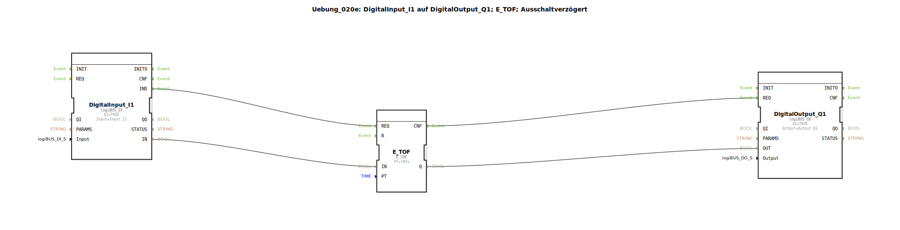

# Uebung_020e: DigitalInput_I1 auf DigitalOutput_Q1; E_TOF; Ausschaltverzögert

Dieser Artikel beschreibt die logiBUS®-Übung `Uebung_020e`.

## 🎧 Podcast

* [Infineon BTM9020EP Vollbrücke verstehen](https://podcasters.spotify.com/pod/show/ms-muc-lama/episodes/Infineon-BTM9020EP-Vollbrcke-verstehen-e3b8n24)
* [integrierten Vollbrücken-ICs MOTIX™ BTM9020EP](https://podcasters.spotify.com/pod/show/ms-muc-lama/episodes/integrierten-Vollbrcken-ICs-MOTIX-BTM9020EP-e368kse)

----

## Übersicht

[cite_start]Verwendung des standardisierten ereignisbasierten Timers `E_TOF`[cite: 1]. Die Logik entspricht der Übung 020d, ist aber in einem einzigen Baustein gekapselt. Ein Signal am Eingang `IN` wird sofort zum Ausgang `Q` durchgereicht. Fällt `IN` weg, bleibt `Q` noch für die Zeit `PT` (hier 5 Sekunden) auf `TRUE`.