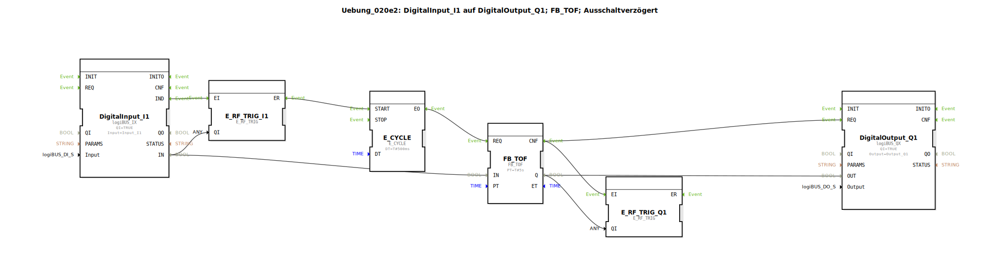

# Uebung_020e2: DigitalInput_I1 auf DigitalOutput_Q1; FB_TOF; Ausschaltverzögert

Dieser Artikel beschreibt die logiBUS®-Übung `Uebung_020e2`. Hier wird der klassische IEC 61131-3 Timer-Baustein `FB_TOF` verwendet, der eine regelmäßige Triggerung (Takt) benötigt.

**Wichtiger Hinweis: Dieser Baustein funktioniert nur korrekt, wenn er zyklisch aufgerufen wird.**

----

## Übersicht

Demonstration des klassischen `FB_TOF` Bausteins. Da dieser Baustein zyklische Abfragen benötigt, wird er wie in Übung 020c3 über einen `E_CYCLE` (hier 500ms) angetrieben. Zusätzlich sorgt ein zweiter `E_SWITCH` am Ausgang dafür, dass der Taktgeber `E_CYCLE` gestoppt wird, sobald die Nachlaufzeit beendet ist.