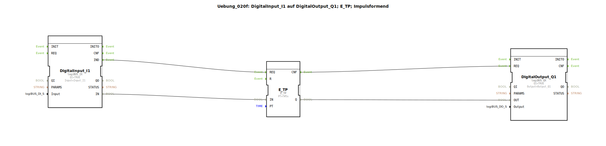

# Uebung_020f: DigitalInput_I1 auf DigitalOutput_Q1; E_TP; Impulsformend

Dieser Artikel beschreibt die logiBUS®-Übung `Uebung_020f`.

----

## Ziel der Übung

Nutzung des impulsformenden Timers `E_TP` (Timer Pulse).

-----

## Funktionsweise

[cite_start]Sobald der Eingang `IN` auf `TRUE` wechselt, schaltet der Ausgang `Q` für exakt die Zeit `PT` (hier 5 Sekunden) ein[cite: 1].
Das Besondere: Der Ausgang bleibt für die volle Zeit aktiv, auch wenn der Eingang `IN` zwischendurch wieder abfällt oder mehrfach gedrückt wird (nicht re-triggerbar).

-----

## Anwendungsbeispiel

**Türöffner**: Ein kurzer Druck auf den Taster lässt den elektrischen Türöffner für 5 Sekunden summen, damit der Gast eintreten kann. Die Zeit läuft unabhängig davon ab, wie lange der Bewohner den Taster tatsächlich gedrückt hält.