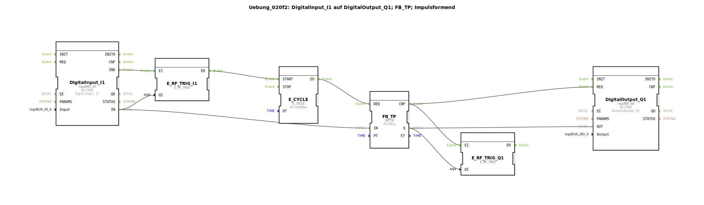

# Uebung_020f2: DigitalInput_I1 auf DigitalOutput_Q1; FB_TP; Impulsformend

Dieser Artikel beschreibt die logiBUS®-Übung `Uebung_020f2`. Hier wird der klassische IEC 61131-3 Timer-Baustein `FB_TP` verwendet.

----

## Übersicht

Diese Übung implementiert einen Impulsgeber unter Verwendung des klassischen `FB_TP` Bausteins. Da dieser Baustein für eine zyklische SPS-Umgebung entworfen wurde, muss in der ereignisbasierten IEC 61499 ein `E_CYCLE` zur regelmäßigen Triggerung genutzt werden.

## Funktionsweise

1.  **Trigger**: Die steigende Flanke von `Input_I1` startet über einen `E_SWITCH` den Taktgeber `E_CYCLE`.
2.  **Berechnung**: Der `E_CYCLE` triggert alle 500ms den `REQ`-Eingang des `FB_TP`. Nur so kann der Timer intern die Zeit hochzählen und den Ausgang `ET` (Elapsed Time) aktualisieren.
3.  **Abschluss**: Sobald der Impuls beendet ist (`Q` geht auf `FALSE`), stoppt der `E_CYCLE` automatisch, um unnötige CPU-Last zu vermeiden.

-----

## ⚖️ Vergleich zur AX-Variante

Im Gegensatz zur `AX_FB_TP` Variante (Übung 020f2_AX) werden hier klassische boolesche Ein- und Ausgänge verwendet, anstatt auf die flexibleren AX-Adapter zu setzen. Die zugrunde liegende Problematik des zyklischen Aufrufs bleibt jedoch identisch.