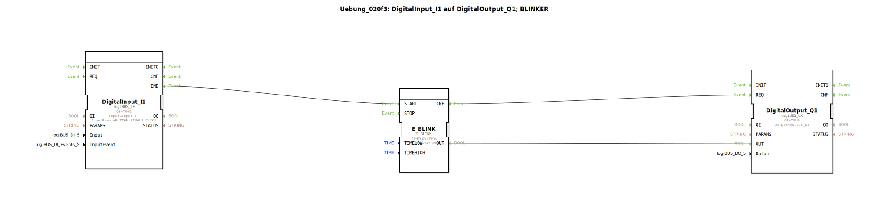

# Uebung_020f3: DigitalInput_I1 auf DigitalOutput_Q1; BLINKER

Dieser Artikel beschreibt die logiBUS®-Übung `Uebung_020f3`.

----

## Übersicht

[cite_start]Verwendung des spezialisierten Blinker-Bausteins `E_BLINK`[cite: 1]. Dieser Baustein fasst die gesamte Logik der Übung 007a3 zusammen.
Über getrennte Parameter für `TIMELOW` und `TIMEHIGH` können asymmetrische Blinkmuster (z.B. kurzes Blitzen) einfach realisiert werden. Ein Ereignis am Eingang `START` setzt den Blinker in Gang.

