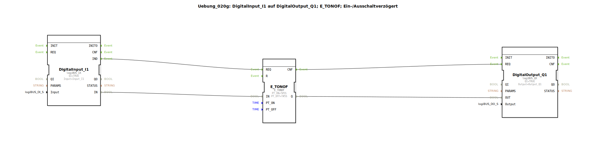

# Uebung_020g: DigitalInput_I1 auf DigitalOutput_Q1; E_TONOF; Ein-/Ausschaltverzögert

Dieser Artikel beschreibt die logiBUS®-Übung `Uebung_020g`.

----

## Ziel der Übung

Verwendung des Bausteins `E_TONOF`, der sowohl eine Einschalt- als auch eine Ausschaltverzögerung in einem Gehäuse bietet.

-----

## Funktionsweise

[cite_start]Der Baustein reagiert auf den Pegel am Eingang `IN`[cite: 1]:

*   Wechsel zu `TRUE`: Der Ausgang wird erst nach Ablauf von `PT_ON` (5s) aktiv.
*   Wechsel zu `FALSE`: Der Ausgang bleibt noch für die Zeit `PT_OFF` (5s) aktiv.

Dies filtert kurze Impulse (Störungen) am Eingang komplett heraus und sorgt gleichzeitig für einen definierten Nachlauf.