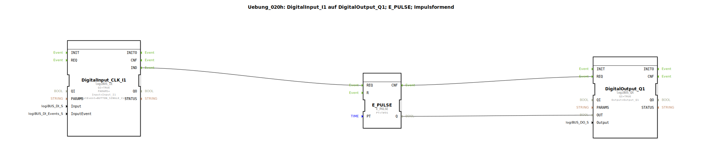

# Uebung_020h: DigitalInput_I1 auf DigitalOutput_Q1; E_PULSE; Impulsformend

Dieser Artikel beschreibt die logiBUS®-Übung `Uebung_020h`.

----

## Übersicht

[cite_start]Diese Übung zeigt die Ansteuerung des Bausteins `E_PULSE` durch einen Ereignis-Eingang (`logiBUS_IE`)[cite: 1].
Jeder erkannte Einzelklick am Taster löst am Ausgang einen exakt 5 Sekunden langen Impuls aus. Da `E_PULSE` ein reiner Event-Baustein ist, benötigt er kein dauerhaftes Datensignal am Eingang, sondern nur den Start-Trigger.

