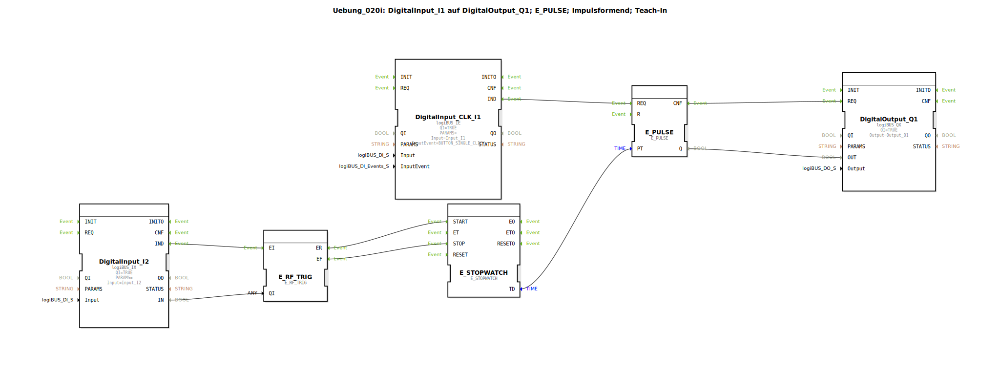

# Uebung_020i: DigitalInput_I1 auf DigitalOutput_Q1; E_PULSE; Impulsformend; Teach-In

Dieser Artikel beschreibt die logiBUS®-Übung `Uebung_020i`. Dies ist eine sehr praxisnahe Übung, bei der eine Zeitdauer nicht durch Zahlenwerte, sondern durch "Vormachen" (Teach-In) gelernt wird.

----

## Ziel der Übung

Programmierung einer variablen Impulsdauer unter Verwendung des `E_STOPWATCH` Bausteins.

-----

## Beschreibung und Komponenten

[cite_start]Die Subapplikation `Uebung_020i.SUB` nutzt zwei Taster: Einen zum Ausführen und einen zum Lernen der Zeit[cite: 1].

### Funktionsbausteine (FBs)

  * **`E_STOPWATCH`**: Misst die Zeit zwischen einem Start- und einem Stopp-Ereignis.
  * **`E_PULSE`**: Erzeugt den zeitgesteuerten Impuls.
  * **`I2` (Lern-Taster)**: Ein normaler Pegel-Eingang (`IX`).
  * **`I1` (Start-Taster)**: Ein Klick-Event-Eingang (`IE`).

-----

## Funktionsweise

1.  **Lern-Modus**: Der Nutzer hält Taster `I2` gedrückt.
    *   Beim Drücken (steigende Flanke) startet die Stoppuhr.
    *   Beim Loslassen (fallende Flanke) stoppt die Stoppuhr.
    *   Die gemessene Zeitdauer (`TD`) wird sofort an den Parameter `PT` des Pulsgebers übergeben.
2.  **Arbeits-Modus**: Der Nutzer klickt kurz auf Taster `I1`.
    *   Der `E_PULSE` wird getriggert.
    *   Er schaltet den Ausgang für genau die Zeit an, die vorher mit Taster `I2` "vorgegeben" wurde.

-----

## Anwendungsbeispiel

**Zentralschmierung oder Bewässerung**:
Anstatt mühsam Sekundenwerte in ein Terminal einzutippen, drückt der Wartungstechniker einmalig so lange auf den Lern-Taster, wie er meint, dass der Vorgang dauern soll. Die Steuerung übernimmt diese Zeitspanne für alle zukünftigen automatischen Zyklen.