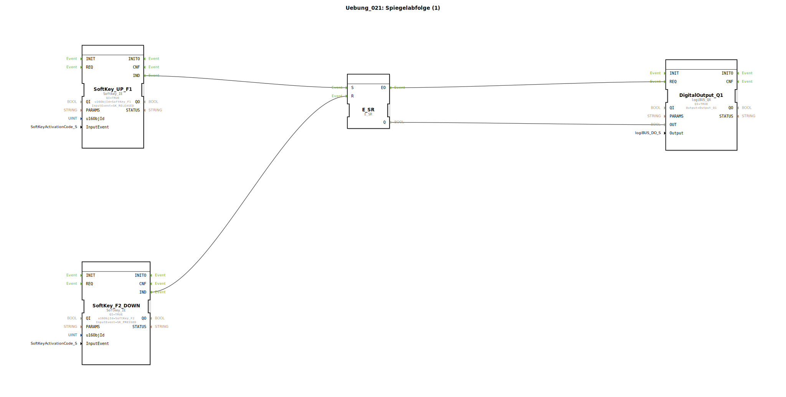

# Uebung_021: Spiegelabfolge (1)

Dieser Artikel beschreibt die logiBUS®-Übung `Uebung_021`. Dies ist der Einstieg in die Ablaufsteuerung (Sequenzierung), simuliert am Beispiel eines Pneumatik-Zylinders.

## 🎧 Podcast

* [Infineon MOTIX BTM9020/9021EP: Datenblatt-Analyse für Automotive – Robuster Motortreiber mit intelligenter Diagnose (HW vs. SPI)](https://podcasters.spotify.com/pod/show/ms-muc-lama/episodes/Infineon-MOTIX-BTM90209021EP-Datenblatt-Analyse-fr-Automotive--Robuster-Motortreiber-mit-intelligenter-Diagnose-HW-vs--SPI-e39av51)
* [JBC Lötspitzen C470 vs. C245 vs. C210 vs. C115: Welche Spitze ist der Allrounder und wann brauchst du den Nano-Spezialisten?](https://podcasters.spotify.com/pod/show/ms-muc-lama/episodes/JBC-Ltspitzen-C470-vs--C245-vs--C210-vs--C115-Welche-Spitze-ist-der-Allrounder-und-wann-brauchst-du-den-Nano-Spezialisten-e39ak58)

----

## Ziel der Übung

Realisierung einer einfachen Folgesteuerung: Ein Prozess wird gestartet und stoppt automatisch, sobald eine Endlage erreicht ist.

-----

## Beschreibung und Komponenten

[cite_start]Die Subapplikation `Uebung_021.SUB` nutzt zwei Softkeys, um die Bewegung eines Aktors (`Q1`) zu steuern[cite: 1].

### Funktionsbausteine (FBs)

  * **`SoftKey_UP_F1`**: Fungiert als **START-Taster**. [cite_start]Er ist auf `SK_RELEASED` konfiguriert[cite: 1].
  * **`SoftKey_F2_DOWN`**: Simuliert den **Endlagenschalter**. [cite_start]Er reagiert sofort beim Drücken (`SK_PRESSED`)[cite: 1].
  * **`E_SR`**: Der Speicher für den Bewegungszustand.
  * **`DigitalOutput_Q1`**: Der Ausgang für das Zylinderventil.

-----

## Funktionsweise

1.  **Start**: Der Nutzer klickt auf **F1**. Das Ereignis setzt den Speicher `E_SR.S` ➡️ Der Ausgang `Q1` wird aktiv, der Zylinder fährt aus.
2.  **Bewegung**: Der Zylinder bewegt sich physikalisch (oder in der Simulation) zur Endposition.
3.  **Stopp**: Sobald der Zylinder die Endlage erreicht, wird (simuliert durch **F2**) der Reset-Eingang `E_SR.R` getriggert ➡️ Der Ausgang `Q1` wird deaktiviert, die Bewegung stoppt.

-----

## Anwendungsbeispiel

**Einfacher Ausstoßer**:
In einer Fertigungslinie soll ein Paket per Knopfdruck vom Band geschoben werden. Der Bediener gibt den Startimpuls, der Zylinder fährt aus, schiebt das Paket weg und wird durch einen mechanischen Endschalter am Ende des Weges automatisch wieder abgeschaltet.