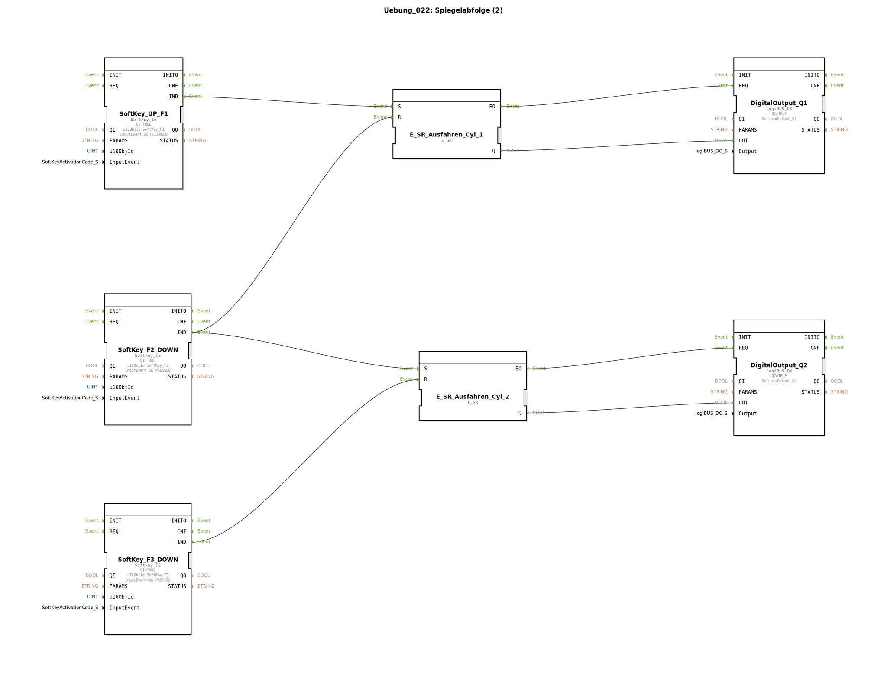

# Uebung_022: Spiegelabfolge (2)


[](https://notebooklm.google.com/notebook/a6872e59-1dfc-4132-a118-aff1bc7bc944)

Dieser Artikel beschreibt die logiBUS®-Übung `Uebung_022`. Hier wird die Ablaufsteuerung auf zwei nacheinander folgende Schritte erweitert.

## 🎧 Podcast




* [Als Landtechnik-Spezialist durch die Hölle: Wie Lanz-Wery Krieg, Besatzung und Hyperinflation überlebte – Einblicke in Original-Geschäftsberichte 1915-1922](https://podcasters.spotify.com/pod/show/ms-muc-lama/episodes/Als-Landtechnik-Spezialist-durch-die-Hlle-Wie-Lanz-Wery-Krieg--Besatzung-und-Hyperinflation-berlebte--Einblicke-in-Original-Geschftsberichte-1915-1922-e39athj)

----


## Ziel der Übung

Erlernen der Ereignisverkettung. Das Ende eines Prozesses (Erreichen der Endlage) soll automatisch den nächsten Prozessschritt einleiten.

-----

## Beschreibung und Komponenten

[cite_start]In `Uebung_022.SUB` werden zwei Speicherglieder so verschaltet, dass eine Kaskade entsteht[cite: 1].

### Funktionsbausteine (FBs)

  * **`I1` (Start)**: Startet den gesamten Ablauf.
  * **`I2` (Endlage 1)**: Beendet Schritt 1 und startet Schritt 2.
  * **`I3` (Endlage 2)**: Beendet Schritt 2.
  * **`Q1` & `Q2`**: Die Ausgänge für zwei Zylinder.

-----

## Funktionsweise

```xml
<EventConnections>
    <Connection Source="SoftKey_UP_F1.IND" Destination="E_SR_Cyl_1.S"/>
    <Connection Source="SoftKey_F2_DOWN.IND" Destination="E_SR_Cyl_1.R"/>
    <Connection Source="SoftKey_F2_DOWN.IND" Destination="E_SR_Cyl_2.S"/>
    <Connection Source="SoftKey_F3_DOWN.IND" Destination="E_SR_Cyl_2.R"/>
</EventConnections>
```

[cite_start][cite: 1]

Der Ablauf:
1.  Klick auf **F1** ➡️ Zylinder 1 fährt aus (`Q1`).
2.  Zylinder 1 erreicht Endlage (**F2**) ➡️ `Q1` wird abgeschaltet **UND** zeitgleich wird Zylinder 2 gestartet (`Q2`).
3.  Zylinder 2 erreicht seine Endlage (**F3**) ➡️ `Q2` wird abgeschaltet.

-----

## Anwendungsbeispiel

**Zweistufige Paketübergabe**:
Zylinder 1 schiebt ein Paket aus einem Magazin auf einen Hubtisch. Sobald das Paket dort ankommt (Endschalter 1), stoppt Zylinder 1 und Zylinder 2 hebt den Tisch an.