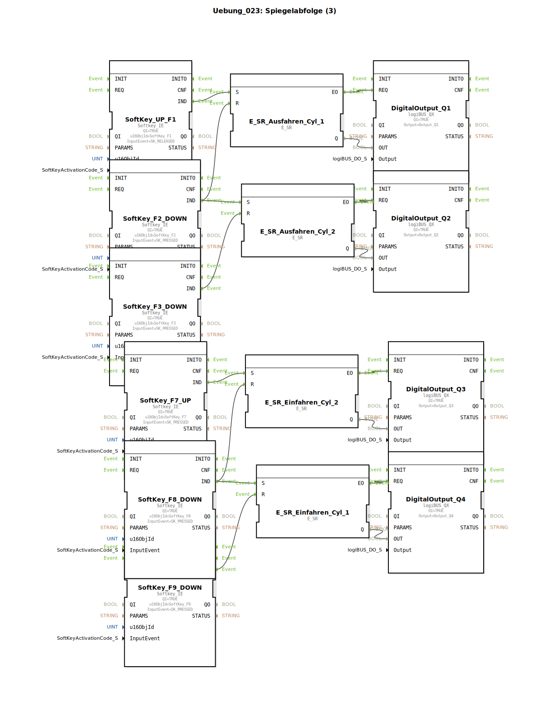

# Uebung_023: Spiegelabfolge (3)

Dieser Artikel beschreibt die logiBUS®-Übung `Uebung_023`. Hier wird ein vollständiger Hin- und Rückweg für zwei Zylinder implementiert.

----

## Übersicht

[cite_start]Diese Übung erweitert die Logik auf insgesamt vier Phasen unter Verwendung von sechs Softkeys[cite: 1]:

1.  **Ausfahren**: `F1` (Start) ➡️ `Q1` an. Endlage erreicht über `F2`.
2.  **Folgeschritt**: `F2` stoppt `Q1` und startet `Q2`. Endlage erreicht über `F3`.
3.  **Einfahren**: Über separate Taster (`F7`, `F8`) wird die Rückhol-Sequenz eingeleitet (`Q3`, `Q4`).

Dies zeigt die Handhabung von komplexen, richtungsabhängigen Abläufen in einer flachen Ereignisstruktur.