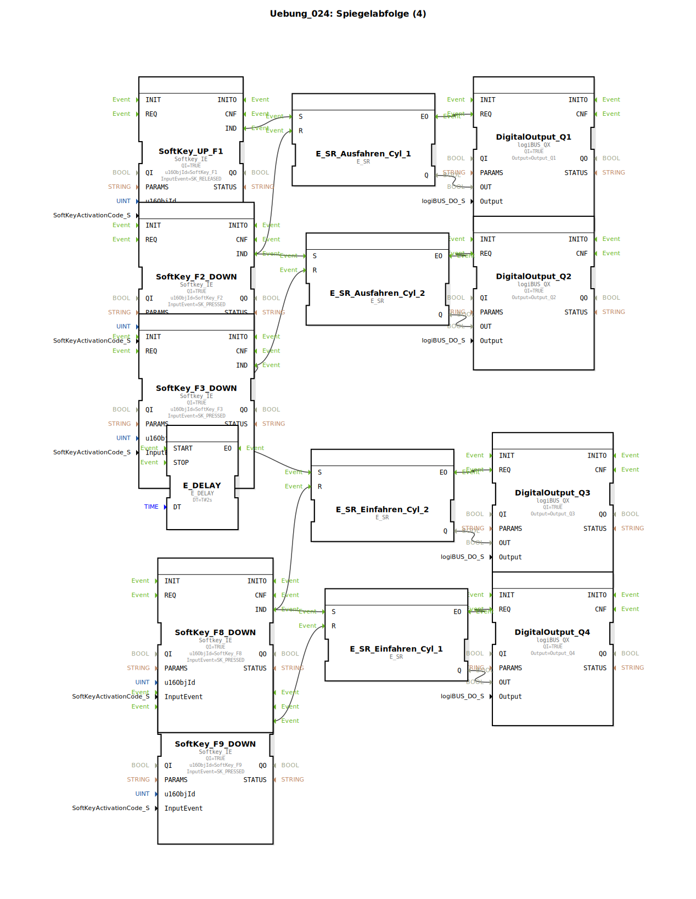

# Uebung_024: Spiegelabfolge (4)

Dieser Artikel beschreibt die logiBUS®-Übung `Uebung_024`. Hier wird eine zeitliche Pause in den automatischen Ablauf integriert.

## 🎧 Podcast

* [Analyse der Novellierung der Meisterprüfungsverordnung im Land- und Baumaschinenmechatroniker-Handwerk: Ein Detaillierter Vergleich der Verordnungen von 2024 und 2001](https://podcasters.spotify.com/pod/show/ms-muc-lama/episodes/Analyse-der-Novellierung-der-Meisterprfungsverordnung-im-Land--und-Baumaschinenmechatroniker-Handwerk-Ein-Detaillierter-Vergleich-der-Verordnungen-von-2024-und-2001-e37aejv)
* [JBC Lötspitzen C470 vs. C245 vs. C210 vs. C115: Welche Spitze ist der Allrounder und wann brauchst du den Nano-Spezialisten?](https://podcasters.spotify.com/pod/show/ms-muc-lama/episodes/JBC-Ltspitzen-C470-vs--C245-vs--C210-vs--C115-Welche-Spitze-ist-der-Allrounder-und-wann-brauchst-du-den-Nano-Spezialisten-e39ak58)
* [Strip-Till im Maisanbau: Wie Hochpräzision Wasser spart und den Boden schützt – Einblick in die Agrartechnik 2024](https://podcasters.spotify.com/pod/show/ms-muc-lama/episodes/Strip-Till-im-Maisanbau-Wie-Hochprzision-Wasser-spart-und-den-Boden-schtzt--Einblick-in-die-Agrartechnik-2024-e3ahcvp)

----

## Ziel der Übung

Integration von Zeitgliedern (`E_DELAY`) in eine Ereigniskette.

-----

## Funktionsweise

[cite_start]Im Vergleich zu Übung 023 wird zwischen zwei Schritten ein Verzögerungs-Baustein eingefügt[cite: 1].
Wenn Zylinder 2 seine Endlage erreicht (`F3`), wird nicht sofort der nächste Schritt ausgelöst, sondern der Eingang `E_DELAY.START` getriggert. Erst nach Ablauf der Zeit `DT` (hier 2 Sekunden) feuert das `EO`-Event und setzt die Sequenz fort (z.B. Start des Einfahrens).

-----

## Anwendungsbeispiel

**Pressvorgang**:
Ein Zylinder fährt aus und drückt zwei Bauteile zusammen. Sobald die Endlage erreicht ist, muss der Druck für 2 Sekunden gehalten werden (Wartezeit), bevor der Zylinder wieder einfährt und das Werkstück freigibt.