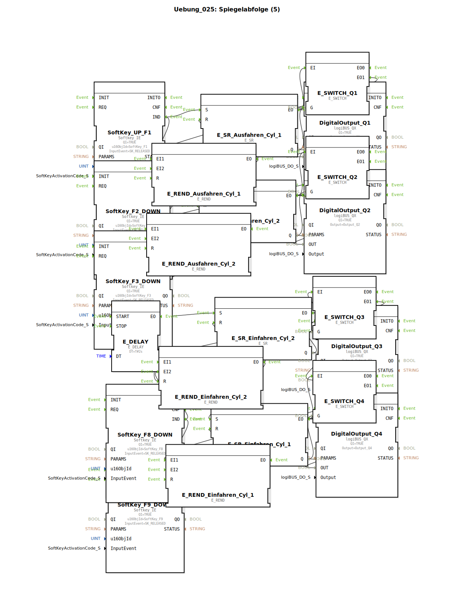

# Uebung_025: Spiegelabfolge (5)

Dieser Artikel beschreibt die logiBUS®-Übung `Uebung_025`. Hier wird die Ablaufsteuerung durch Rendezvous-Bausteine abgesichert.

## 📺 Video

* [Löten im Jahr 2025](https://www.youtube.com/watch?v=fpcOFSE5sl0)

## 🎧 Podcast

* [ETFA 2025: Plug and Produce – Wie IEC 61499 die Fabrikautomation revolutioniert](https://podcasters.spotify.com/pod/show/iec-61499-grundkurs-de/episodes/ETFA-2025-Plug-and-Produce--Wie-IEC-61499-die-Fabrikautomation-revolutioniert-e376pnk)
* [IEC 61499: Sprung in die Industrie – ETFA 2025 und die Zukunft der Automatisierung](https://podcasters.spotify.com/pod/show/iec-61499-grundkurs-de/episodes/IEC-61499-Sprung-in-die-Industrie--ETFA-2025-und-die-Zukunft-der-Automatisierung-e376pnm)
* [Industrial Revolution Reloaded: Unpacking Plug & Produce, Data Privacy, and ETFA 2025](https://podcasters.spotify.com/pod/show/iec-61499-grundkurs-de/episodes/Industrial-Revolution-Reloaded-Unpacking-Plug--Produce--Data-Privacy--and-ETFA-2025-e376pid)
* [Revolutionen der Industrie: Von Dampfmaschine bis KI – Ein tiefer Einblick in 250 Jahre Automatisierung](https://podcasters.spotify.com/pod/show/iec-61499-grundkurs-de/episodes/Revolutionen-der-Industrie-Von-Dampfmaschine-bis-KI--Ein-tiefer-Einblick-in-250-Jahre-Automatisierung-e375ei5)
* [Das Kettenmonster erwacht: Lanz Bulldog Raupe – Die faszinierende Wiederbelebung des 10-Liter-Glühkopf-Arbeitstiers nach 25 Jahren Stillstand](https://podcasters.spotify.com/pod/show/ms-muc-lama/episodes/Das-Kettenmonster-erwacht-Lanz-Bulldog-Raupe--Die-faszinierende-Wiederbelebung-des-10-Liter-Glhkopf-Arbeitstiers-nach-25-Jahren-Stillstand-e39arpd)

----

## Ziel der Übung

Verwendung von `E_REND` zur Absicherung von Übergängen. Es soll sichergestellt werden, dass ein Folgeschritt nur dann ausgelöst wird, wenn sowohl das Hardware-Feedback (Endlage) als auch das logische Software-Event (Bereitschaft) vorliegen.

-----

## Funktionsweise

[cite_start]Die Übung nutzt für jeden Übergang einen `E_REND` Baustein[cite: 1].
Zusätzlich werden `E_SWITCH` Bausteine zur Plausibilitätsprüfung eingesetzt. Ein Ereignis wird nur dann als gültige Endlage akzeptiert, wenn der zugehörige Ausgang (`Q`) der Steuerung zu diesem Zeitpunkt auch tatsächlich aktiv ist (Rückkopplung der Daten an das Gate der Weiche). Dies verhindert Fehlsteuerungen durch defekte oder hängende Sensoren.