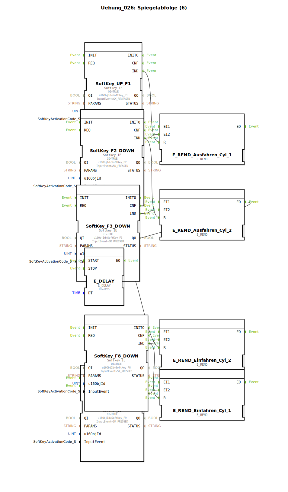

# Uebung_026: Spiegelabfolge (6)

Dieser Artikel beschreibt die logiBUS®-Übung `Uebung_026`.

----

## Übersicht

[cite_start]In dieser Übung wird die komplexe Ablauflogik aus Übung 025 beibehalten, jedoch wird die Ansteuerung der Hardware-Ausgänge in eine typisierte Sub-Applikation `Uebung_026_sub` ausgelagert[cite: 1].
Jede Instanz dieser Sub-App (`Q1` bis `Q4`) kapselt einen SR-Speicher und den Hardware-Ausgangsbaustein. Das Hauptdiagramm wird dadurch wesentlich übersichtlicher, da nur noch die Ereigniskette zwischen den Phasen (Rendezvous und Delays) sichtbar ist, während die "Leistungsebene" im Hintergrund arbeitet.

