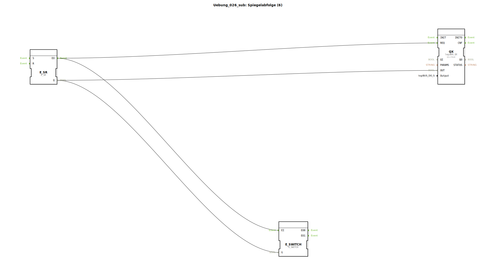

# Uebung_026_sub: Spiegelabfolge (6)

Dieser Artikel beschreibt den Sub-App-Typ `Uebung_026_sub`. Dieser Baustein dient als standardisiertes Interface für Aktoren innerhalb einer komplexen Schrittkette.

----

## Ziel der Übung

Kapselung der Ausgangs-Logik. Der Baustein trennt die Ablauf-Logik (wann muss was passieren) von der Hardware-Logik (wie wird der Zylinder angesteuert).

-----

## Beschreibung und Komponenten

[cite_start]Der Typ `Uebung_026_sub` kombiniert einen Speicher mit einer Plausibilitätsprüfung[cite: 1].

### Interne Funktionsbausteine (FBs)

  * **`E_SR`**: Speichert, ob der Aktor gerade aktiv sein soll.
  * **`QX`**: Typ `logiBUS_QX`. Steuert den physischen Port an.
  * **`E_SWITCH`**: Dient als Rückmelde-Gatter. [cite_start]Nur wenn der Speicher tatsächlich auf TRUE steht, wird das Bestätigungs-Event am Ausgang `EO1` weitergegeben[cite: 1].

-----

## Schnittstellen

[cite_start]Der Baustein bietet eine klare Event-Schnittstelle[cite: 1]:
*   **`SET`**: Schaltet den Aktor ein.
*   **`RESET`**: Schaltet den Aktor aus.
*   **`EO1`**: Meldet den erfolgreichen Vollzug des Einschaltbefehls zurück (Quittierung).

In der Hauptanwendung ermöglicht dieser Typ eine sehr übersichtliche Verschaltung der Phasenübergänge, da die Details der Speicherverwaltung und Hardware-Adressierung im Inneren verborgen bleiben.

## 🛠️ Zugehörige Übungen

* [Uebung_026](Uebung_026.md)

