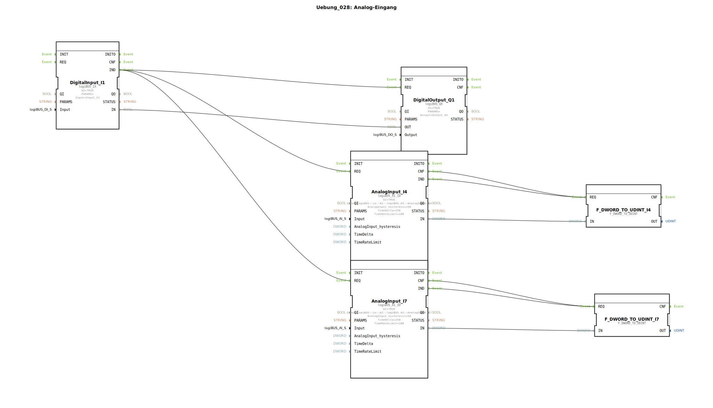

# Uebung_028: Analog-Eingang

Dieser Artikel beschreibt die logiBUS®-Übung `Uebung_028`. Hier verlassen wir die digitale Welt (An/Aus) und erfassen kontinuierliche Messwerte (Analogsignale).

----

## Ziel der Übung

Verwendung des Bausteins `logiBUS_AI_ID`. Es wird demonstriert, wie analoge Spannungswerte (z.B. von einem Potentiometer oder Sensor) eingelesen, gefiltert (Hysterese) und konvertiert werden.

-----

## Beschreibung und Komponenten

[cite_start]Die Subapplikation `Uebung_028.SUB` liest zwei Analogkanäle der Hardware ein[cite: 1].

### Funktionsbausteine (FBs)

  * **`AnalogInput_I4` & `I7`**: Typ `logiBUS_AI_ID`. [cite_start]Diese Bausteine repräsentieren die analogen Hardware-Eingänge. Sie wandeln die elektrische Spannung in einen numerischen Digitalwert um[cite: 1].
  * **Parameter `AnalogInput_hysteresis`**: Bestimmt, um wie viel sich der Wert ändern muss, bevor ein neues Ereignis (`IND`) gefeuert wird (hier 50 Einheiten). Dies unterdrückt Rauschen.
  * **`F_DWORD_TO_UDINT`**: Konvertiert den Rohwert in einen Ganzzahl-Datentyp zur weiteren Verarbeitung.

-----

## Funktionsweise

Der Analogbaustein bietet zwei Möglichkeiten der Abfrage:
1.  **Ereignisgesteuert**: Sobald sich die Eingangsspannung signifikant ändert (außerhalb der Hysterese), sendet der Baustein automatisch ein `IND`-Event.
2.  **Manuell (Polling)**: In dieser Übung triggert zusätzlich der digitale Taster `I1` den `REQ`-Eingang der Analog-Bausteine. Dies erzwingt eine sofortige Aktualisierung der Werte, egal ob sie sich geändert haben oder nicht.

-----

## Anwendungsbeispiel

**Tankinhalts-Anzeige**:
Ein Schwimmersensor im Tank liefert eine analoge Spannung. Die Steuerung liest diesen Wert ein. Durch die Hysterese wird verhindert, dass die Anzeige bei leichtem Schwanken des Kraftstoffs ständig flackert. Der Nutzer kann jederzeit einen Knopf am Bedienpult drücken, um den absolut aktuellen Wert sofort abzufragen.