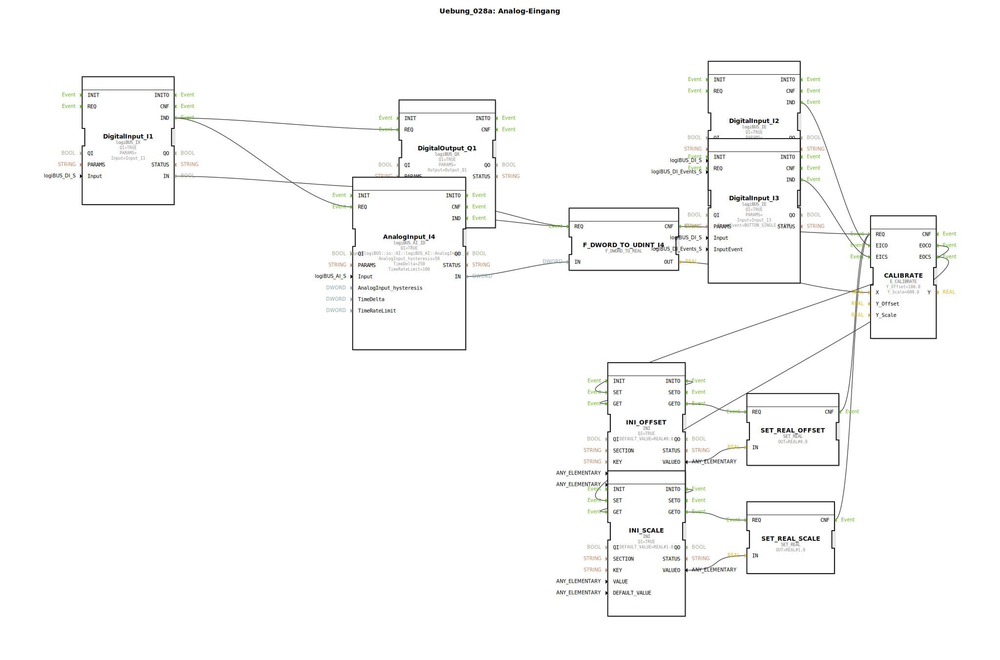

# Uebung_028a: Analog-Eingang

* * * * * * * * * *

## Einleitung

Diese Übung demonstriert die Verarbeitung eines analogen Eingangssignals mit Kalibrierung. Es werden digitale Taster zur Kalibrierung von Offset und Skalierung verwendet, und die ermittelten Kalibrierungsparameter werden nichtflüchtig gespeichert. Die Übung zeigt den Umgang mit analogen Eingangsbausteinen, Typkonvertierung, Kalibrierungsfunktionen und Speicherbausteinen in der 4diac-IDE.

## Verwendete Funktionsbausteine (FBs)

- **DigitalOutput_Q1** (logiBUS_QX): Digitaler Ausgang Q1.
- **DigitalInput_I1** (logiBUS_IX): Digitaler Eingang I1.
- **AnalogInput_I4** (logiBUS_AI_ID): Analoger Eingang I4.
  - Parameter: AnalogInput_hysteresis = 50, TimeDelta = 250, TimeRateLimit = 100.
- **F_DWORD_TO_UDINT_I4** (F_DWORD_TO_REAL): Konvertierung eines DWORD-Wertes nach REAL.
- **CALIBRATE** (E_CALIBRATE): Kalibrierungsbaustein.
  - Parameter: Y_Offset = 100.0, Y_Scale = 600.0.
- **DigitalInput_I2** (logiBUS_IE): Digitaler Eingang I2 mit Ereignis BUTTON_SINGLE_CLICK – dient als Taster zur Offset-Kalibrierung.
- **DigitalInput_I3** (logiBUS_IE): Digitaler Eingang I3 mit Ereignis BUTTON_SINGLE_CLICK – dient als Taster zur Skalierungs-Kalibrierung.
- **INI_OFFSET** (INI): Speicherbaustein für den Offset-Wert.
  - Parameter: DEFAULT_VALUE = REAL#0.0.
- **SET_REAL_OFFSET** (SET_REAL): Stellt den gespeicherten Offset-Wert als REAL bereit (initial 0.0).
- **INI_SCALE** (INI): Speicherbaustein für den Skalierungs-Wert.
  - Parameter: DEFAULT_VALUE = REAL#1.0.
- **SET_REAL_SCALE** (SET_REAL): Stellt den gespeicherten Skalierungs-Wert als REAL bereit (initial 1.0).

## Programmablauf und Verbindungen

Der Ablauf wird durch Ereignisse gesteuert:

1. **DigitalInput_I1** sendet bei Betätigung ein `IND`-Ereignis. Dieses triggert gleichzeitig den digitalen Ausgang **DigitalOutput_Q1** (über `REQ`) und startet den analogen Eingang **AnalogInput_I4** (über `REQ`).
2. **AnalogInput_I4** erfasst einen analogen Wert und gibt ihn als DWORD an seinem Ausgang `IN` aus. Gleichzeitig wird ein `IND`-Ereignis gesendet, das den Konvertierungsbaustein **F_DWORD_TO_UDINT_I4** aktiviert.
3. **F_DWORD_TO_UDINT_I4** wandelt den DWORD-Wert nach REAL um und übergibt das Ergebnis an den Kalibrierungsbaustein **CALIBRATE** über dessen Eingang `X`.
4. Der Benutzer kann die Kalibrierung manuell auslösen:
   - **DigitalInput_I2** (Taster) sendet ein `IND`-Ereignis an `EICO` von **CALIBRATE** → löst die Offset-Kalibrierung aus.
   - **DigitalInput_I3** (Taster) sendet ein `IND`-Ereignis an `EICS` von **CALIBRATE** → löst die Skalierungs-Kalibrierung aus.
5. **CALIBRATE** berechnet aus dem Rohwert und den aktuellen Kalibrierparametern (Offset und Skalierung) den korrigierten Wert. Die neuen Parameter werden an den Ausgängen `OFFSET` und `SCALE` ausgegeben.
6. Diese neuen Parameter werden über Datenverbindungen in die Speicherbausteine **INI_OFFSET** und **INI_SCALE** geschrieben (Ereignis `SET` wird von **CALIBRATE** über `EOCO` bzw. `EOCS` gesendet).
7. Die gespeicherten Werte werden nach dem Initialisieren (`INITO` → `GET`) über **SET_REAL_OFFSET** und **SET_REAL_SCALE** zurück an **CALIBRATE** geführt, sodass die Kalibrierung dauerhaft erhalten bleibt.

Die Datenflüsse verbinden:
- `AnalogInput_I4.IN` → `F_DWORD_TO_UDINT_I4.IN`
- `F_DWORD_TO_UDINT_I4.OUT` → `CALIBRATE.X`
- `INI_OFFSET.VALUEO` → `SET_REAL_OFFSET.IN` → `SET_REAL_OFFSET.OUT` → `CALIBRATE.OFFSET`
- `INI_SCALE.VALUEO` → `SET_REAL_SCALE.IN` → `SET_REAL_SCALE.OUT` → `CALIBRATE.SCALE`
- Zurückschreiben: `CALIBRATE.OFFSET` → `INI_OFFSET.VALUE`, `CALIBRATE.SCALE` → `INI_SCALE.VALUE`

## Zusammenfassung

Die Übung vermittelt den Umgang mit analogen Eingängen, deren Typkonvertierung sowie die Implementierung einer benutzergesteuerten Kalibrierung. Die Kalibrierungsparameter (Offset und Skalierung) werden in nichtflüchtigen Speichern gehalten und können über Taster angepasst werden. Der Beispielcode zeigt, wie Ereignis- und Datenflüsse in einer SubApp strukturiert werden können, um eine robuste und wiederholgenaue Analogwerterfassung zu realisieren.