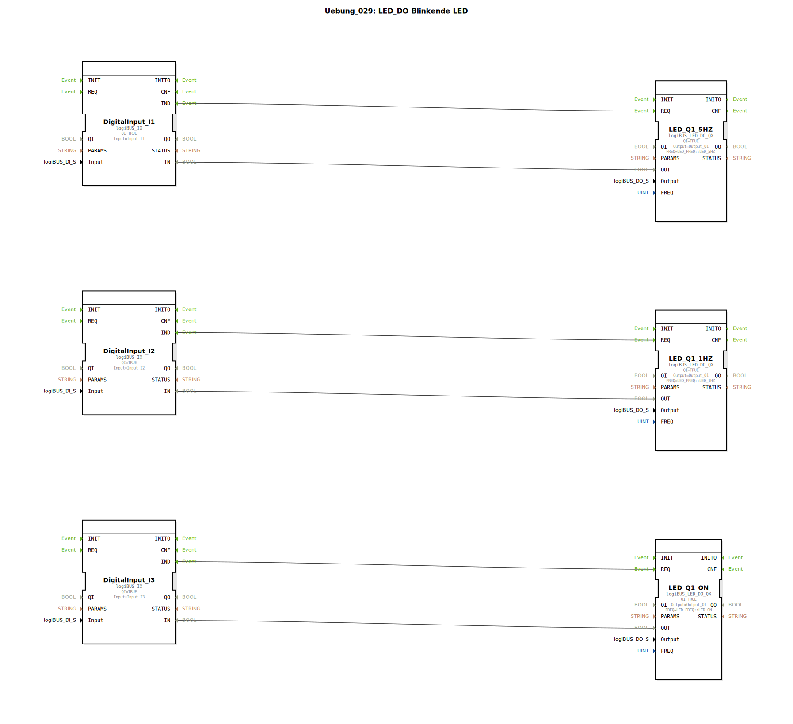

# Uebung_029: LED_DO Blinkende LED

Dieser Artikel beschreibt die logiBUS®-Übung `Uebung_029`. Hier wird ein spezialisierter Baustein zur Ansteuerung von Status-LEDs vorgestellt, der das Blinken hardwarenah übernimmt.

----

## Ziel der Übung

Nutzung des Bausteins `logiBUS_LED_DO_QX`. Es wird gezeigt, wie man eine LED in verschiedenen Modi (Dauerlicht, langsames Blinken, schnelles Blinken) betreibt, ohne dafür komplexe Software-Timer oder Blink-Logiken (wie in Übung 007) programmieren zu müssen.

-----

## Beschreibung und Komponenten

[cite_start]In `Uebung_029.SUB` werden drei Taster genutzt, um eine einzige LED (`Q1`) in drei verschiedenen Modi anzusteuern[cite: 1].

### Funktionsbausteine (FBs)

  * **`logiBUS_LED_DO_QX`**: Ein spezialisierter Ausgangsbaustein. Er besitzt den Parameter `FREQ` (Frequenz).
  * **Parameter `FREQ`**:
    * `LED_ON`: Dauerhaftes Leuchten.
    * `LED_1HZ`: Langsames Blinken (1 mal pro Sekunde).
    * `LED_5HZ`: Schnelles Blinken (5 mal pro Sekunde).

-----

## Funktionsweise

Obwohl alle drei Bausteine im Diagramm auf denselben physischen Ausgang `Output_Q1` verweisen, unterscheiden sie sich in ihrer Konfiguration:
*   Druck auf **Taster I1** ➡️ Triggert den 5Hz-Baustein. Die LED blitzt sehr schnell.
*   Druck auf **Taster I2** ➡️ Triggert den 1Hz-Baustein. Die LED blinkt ruhig.
*   Druck auf **Taster I3** ➡️ Triggert den ON-Baustein. Die LED leuchtet konstant.

Die Blink-Frequenz wird dabei direkt vom Hardware-Treiber der Steuerung generiert, was den Prozessor entlastet.

-----

## Anwendungsbeispiel

**Zustands-Signalisierung einer Maschine**:
*   **LED An**: Maschine ist bereit.
*   **LED 1Hz**: Maschine arbeitet (Automatikbetrieb).
*   **LED 5Hz**: Warnung oder Störung (Aufmerksamkeit erforderlich).
Dies ermöglicht eine intuitive Kommunikation mit dem Bediener über eine einzige Kontrollleuchte.