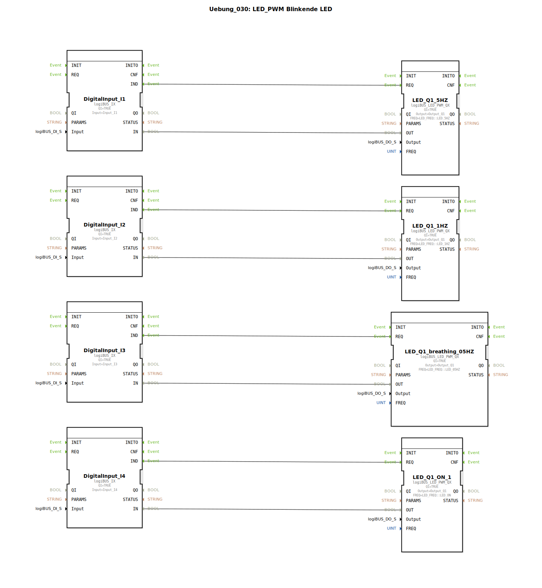

# Uebung_030: LED_PWM Blinkende LED

Dieser Artikel beschreibt die logiBUS®-Übung `Uebung_030`. Hier werden die erweiterten Fähigkeiten der LED-Ansteuerung mittels Pulsweitenmodulation (PWM) demonstriert.

## 🎧 Podcast

* [3000 Watt Lüge Die TVS Diode entschlüsselt](https://podcasters.spotify.com/pod/show/ms-muc-lama/episodes/3000-Watt-Lge-Die-TVS-Diode-entschlsselt-e3aun8t)
* [Der BTS7030-2EPA intelligenter Auto Stromwächter](https://podcasters.spotify.com/pod/show/ms-muc-lama/episodes/Der-BTS7030-2EPA-intelligenter-Auto-Stromwchter-e3b8n3s)
* [Der Intelligente Leistungsschalter: Wie der Infineon BTS7030 Relais und Sicherungen im Auto ersetzt](https://podcasters.spotify.com/pod/show/ms-muc-lama/episodes/Der-Intelligente-Leistungsschalter-Wie-der-Infineon-BTS7030-Relais-und-Sicherungen-im-Auto-ersetzt-e39av14)
* [Infineon BTS7030-2EPA: Intelligenter High-Side Leistungsschalter](https://podcasters.spotify.com/pod/show/ms-muc-lama/episodes/Infineon-BTS7030-2EPA-Intelligenter-High-Side-Leistungsschalter-e368fl3)

----

## Ziel der Übung

Verwendung des Bausteins `logiBUS_LED_PWM_QX`. Es wird gezeigt, wie man weiche Lichteffekte (Pulsieren / "Breathing") realisiert, indem man die Helligkeit der LED über die Hardware-PWM steuert.

-----

## Beschreibung und Komponenten

[cite_start]In `Uebung_030.SUB` werden vier Taster genutzt, um verschiedene PWM-Effekte auf einer LED (`Q1`) auszulösen[cite: 1].

### Funktionsbausteine (FBs)

  * **`logiBUS_LED_PWM_QX`**: Dieser Baustein nutzt die PWM-Hardware, um nicht nur AN/AUS, sondern auch Helligkeitsverläufe darzustellen.
  * **Parameter `FREQ`**:
    * `LED_05HZ`: Ein sehr langsamer "Breathing"-Effekt (Pulsieren der Helligkeit).
    * `LED_1HZ` & `LED_5HZ`: Klassische Blinkfrequenzen.
    * `LED_ON`: Konstante Helligkeit (100%).

-----

## Funktionsweise

Jeder Taster aktiviert eine andere Instanz des PWM-Bausteins, die alle auf denselben physikalischen Ausgang `Output_Q1` wirken.
*   **Taster I3** ➡️ Aktiviert den 0,5 Hz Breathing-Effekt. Die LED wird langsam heller und wieder dunkler.
*   **Taster I1 & I2** ➡️ Aktivieren schnelles oder langsames Blinken.
*   **Taster I4** ➡️ Schaltet die LED auf Dauerlicht.

-----

## Anwendungsbeispiel

**Hochwertige Statusanzeige**:
Anstatt eines harten Blinkens wird ein sanftes Pulsieren der LED genutzt, um einen "Standby"-Zustand oder einen laufenden, unkritischen Hintergrundprozess anzuzeigen. Dies wirkt moderner und weniger störend für den Bediener.