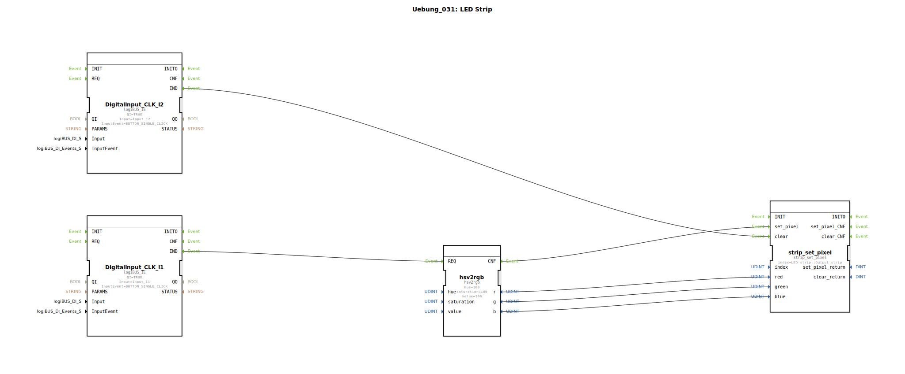

# Uebung_031: LED Strip

Dieser Artikel beschreibt die logiBUS®-Übung `Uebung_031`. Hier steuern wir adressierbare RGB-LEDs (z.B. WS2812) über das komfortable HSV-Farbmodell an.

## 🎧 Podcast

* [Die drei Timer der DIN EN 61131-3 entschlüsselt – TP, TON & TOF präzise erklärt](https://podcasters.spotify.com/pod/show/iec-61499-grundkurs-de/episodes/Die-drei-Timer-der-DIN-EN-61131-3-entschlsselt--TP--TON--TOF-przise-erklrt-e3dma77)
* [DIN EN 61131-3 vs. 61499-1: Dein Wegweiser durch die Normen der Industrieautomatisierung](https://podcasters.spotify.com/pod/show/iec-61499-grundkurs-de/episodes/DIN-EN-61131-3-vs--61499-1-Dein-Wegweiser-durch-die-Normen-der-Industrieautomatisierung-e36c6nc)
* [DIN EN 61131-3: Das Herz der Land- und Baumaschinen-Mechatronik und der Sprung in die Zukunft mit Ob](https://podcasters.spotify.com/pod/show/iec-61499-grundkurs-de/episodes/DIN-EN-61131-3-Das-Herz-der-Land--und-Baumaschinen-Mechatronik-und-der-Sprung-in-die-Zukunft-mit-Ob-e36c2mp)
* [FB_TOF und E_TOF: Verzögerungstimer in IEC 61131-3 und 61499](https://podcasters.spotify.com/pod/show/iec-61499-grundkurs-de/episodes/FB_TOF-und-E_TOF-Verzgerungstimer-in-IEC-61131-3-und-61499-e368e2d)
* [IEC 61499 vs. 61131: Brauchen wir einen neuen Standard für IIoT? Analyse einer hitzigen Debatte um Verteilte Intelligenz](https://podcasters.spotify.com/pod/show/iec-61499-grundkurs-de/episodes/IEC-61499-vs--61131-Brauchen-wir-einen-neuen-Standard-fr-IIoT--Analyse-einer-hitzigen-Debatte-um-Verteilte-Intelligenz-e3ahc2r)

----

## Ziel der Übung

Verwendung der RGB-Bibliothek für den ESP32. Es wird demonstriert, wie man Farben nicht über Rot-Grün-Blau-Werte (RGB), sondern über Farbwert (Hue), Sättigung (Saturation) und Helligkeit (Value) definiert und an einen LED-Streifen sendet.

-----

## Beschreibung und Komponenten

[cite_start]Die Subapplikation `Uebung_031.SUB` nutzt einen Konvertierungsbaustein und einen Streifen-Treiber[cite: 1].

### Funktionsbausteine (FBs)

  * **`hsv2rgb`**: Rechnet die intuitiven HSV-Werte in die von der Hardware benötigten RGB-Werte um.
  * **`strip_set_pixel`**: Überträgt die Farbwerte an eine spezifische LED im Streifen.
  * **`I1` (Set)**: Klick löst das Setzen der Farbe aus.
  * **`I2` (Clear)**: Klick löscht die Anzeige (LED aus).

-----

## Funktionsweise

1.  Der Nutzer klickt auf **I1**. Das Event triggert die Konvertierung.
2.  Der `hsv2rgb` Baustein nimmt die voreingestellten Werte (z.B. Hue=100) und liefert die Anteile für Rot, Grün und Blau.
3.  Das `CNF`-Event des Konverters startet den Hardware-Transfer über `strip_set_pixel`.
4.  Die erste LED am Streifen leuchtet in der gewählten Farbe.

-----

## Anwendungsbeispiel

**Individuelle Design-Beleuchtung**:
In einer Kabine soll die Ambiente-Beleuchtung einstellbar sein. Über ein Drehrad (Poti) wird der `Hue`-Wert verändert. Das Programm rechnet dies permanent um, sodass der Fahrer stufenlos durch den gesamten Regenbogen navigieren kann.