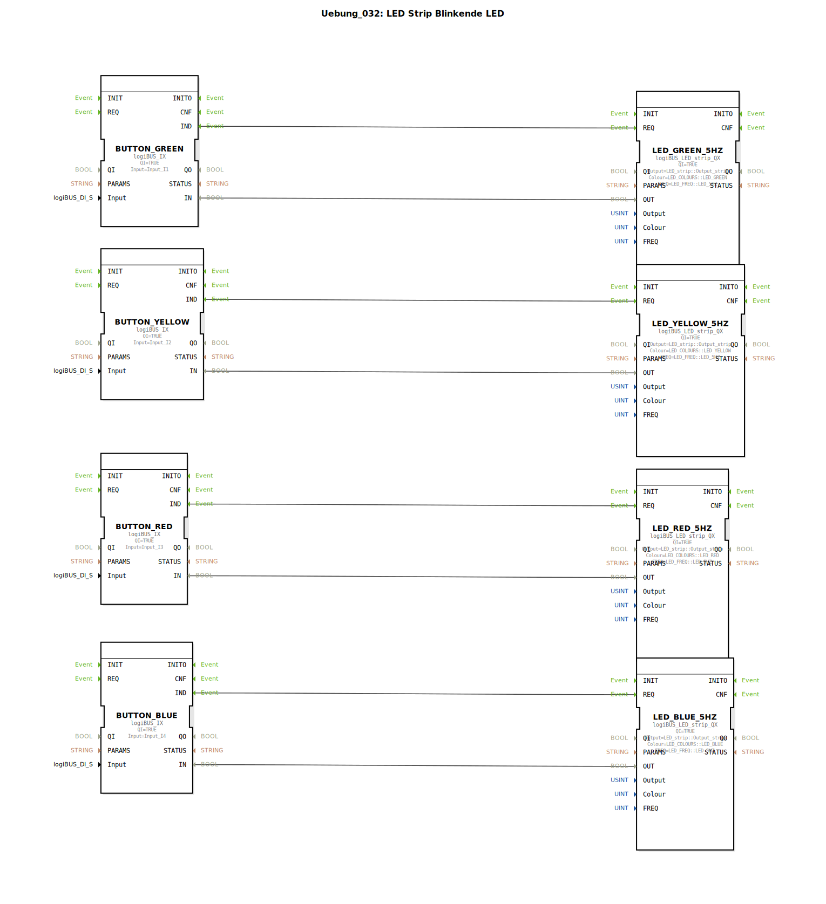

# Uebung_032: LED Strip Blinkende LED

Dieser Artikel beschreibt die logiBUS®-Übung `Uebung_032`. Hier werden vorkonfigurierte Farbbausteine für LED-Streifen genutzt.

## 📺 Video

* [Das ESP32-S3-DevKitC-1](https://www.youtube.com/watch?v=fyQt3THIQEQ)

## 🎧 Podcast

* [ESP32 als Industrie-SPS: Revolution mit Eclipse 4diac und logiBUS®](https://podcasters.spotify.com/pod/show/logibus/episodes/ESP32-als-Industrie-SPS-Revolution-mit-Eclipse-4diac-und-logiBUS-e375dp6)
* [ESP32 as PLC: Democratizing Industrial Automation with Eclipse 4diac](https://podcasters.spotify.com/pod/show/logibus/episodes/ESP32-as-PLC-Democratizing-Industrial-Automation-with-Eclipse-4diac-e375e13)
* [ESP32 wird industrielle SPS für Landmaschinen](https://podcasters.spotify.com/pod/show/logibus/episodes/ESP32-wird-industrielle-SPS-fr-Landmaschinen-e3bf4om)
* [ESP32-S3 Entwicklungsplatinen ESP32-S3-DevKitC-1](https://podcasters.spotify.com/pod/show/ms-muc-lama/episodes/ESP32-S3-Entwicklungsplatinen-ESP32-S3-DevKitC-1-e368gmd)
* [ESP32-S3 im Detail: Dual-Core, 32MB Power und CAN-Bus für Land- und Baumaschinen-Mechatronik](https://podcasters.spotify.com/pod/show/ms-muc-lama/episodes/ESP32-S3-im-Detail-Dual-Core--32MB-Power-und-CAN-Bus-fr-Land--und-Baumaschinen-Mechatronik-e39haf4)

----

## Ziel der Übung

Verwendung des Bausteins `logiBUS_LED_strip_QX`. Dies ist ein High-Level Baustein, der Farbe, Frequenz und Hardware-Anbindung für RGB-Streifen in einem Block vereint.

-----

## Beschreibung und Komponenten

[cite_start]In `Uebung_032.SUB` werden vier verschiedene Farben (Grün, Gelb, Rot, Blau) auf vier Taster gemappt[cite: 1].

### Funktionsbausteine (FBs)

  * **`logiBUS_LED_strip_QX`**: Kombi-Baustein für RGB-Streifen.
  * **Parameter**:
    * `Colour`: Auswahl aus einer Palette (z.B. `LED_RED`).
    * `FREQ`: Blinkfrequenz (hier einheitlich 5 Hz).

-----

## Funktionsweise

Jeder Taster aktiviert "seine" Farbe auf dem Streifen. Da alle Bausteine auf den Parameter `Output_strip` (Kanal 0) konfiguriert sind, überschreiben sie sich gegenseitig.
*   Druck auf **Grün** ➡️ Streifen blitzt schnell grün.
*   Druck auf **Rot** ➡️ Streifen wechselt sofort auf schnelles rotes Blitzen.

Dies ermöglicht eine sehr schnelle Programmierung von farbigen Status-Signalen.