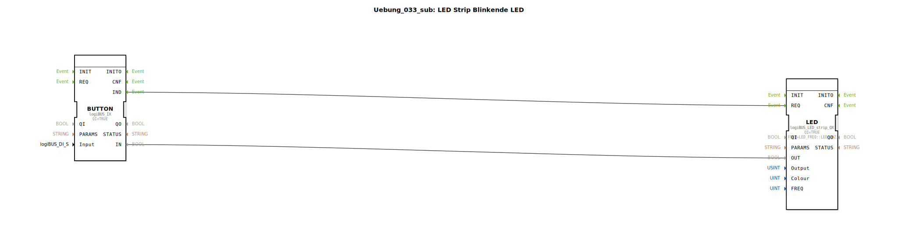

# Uebung_033_sub: LED Strip Blinkende LED

Dieser Artikel beschreibt den Sub-App-Typ `Uebung_033_sub`. Er dient als wiederverwendbares Modul zur Steuerung von farbigen LED-Anzeigen.

----

## Übersicht

[cite_start]Dieser Baustein bündelt einen digitalen Eingangsbaustein (`IX`) und einen spezialisierten RGB-Streifen-Ausgang (`logiBUS_LED_strip_QX`)[cite: 1].
Er stellt Parameter für die Wahl des Eingangs-Buttons (`Input`), der Farbe (`Colour`) und des Ausgangs-Kanals (`Output`) bereit. Intern ist er auf eine feste Blinkfrequenz von 1 Hz voreingestellt. Durch die Kapselung dieser komplexen Treiber-Logik können farbige Status-Anzeigen in Projekten sehr einfach durch Parametrierung statt durch aufwendige Einzelverdrahtung realisiert werden.

## 🛠️ Zugehörige Übungen

* [Uebung_033](Uebung_033.md)

