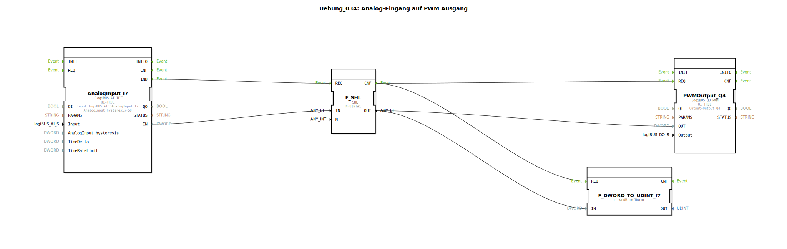

# Uebung_034: Analog-Eingang auf PWM Ausgang

Dieser Artikel beschreibt die logiBUS®-Übung `Uebung_034`. Hier wird ein analoger Messwert genutzt, um die Leistung eines Aktors stufenlos zu regeln.

----

## Ziel der Übung

Verbindung eines Analog-Eingangs (`logiBUS_AI`) mit einem PWM-Ausgang (`logiBUS_QD_PWM`). Es wird demonstriert, wie Datenwerte skaliert werden, um den Stellbereich eines Sensors auf den Leistungsbereich eines Aktors abzubilden.

-----

## Beschreibung und Komponenten

[cite_start]Die Subapplikation `Uebung_034.SUB` liest ein Potentiometer ein und steuert damit die Helligkeit einer Lampe oder die Drehzahl eines Motors[cite: 1].

### Funktionsbausteine (FBs)

  * **`AnalogInput_I7`**: Liest die Spannung am Eingang ein.
  * **`F_SHL`**: Ein Schieberegister-Baustein (Shift Left). [cite_start]Er wird hier zur Skalierung genutzt, indem er den Eingangswert um ein Bit nach links verschiebt (entspricht einer Multiplikation mit 2)[cite: 1].
  * **`PWMOutput_Q4`**: Ein pulsweitenmodulierter Ausgang zur Leistungsstellung.

-----

## Funktionsweise

1.  Jede Änderung am analogen Eingang `I7` löst ein `IND`-Event aus.
2.  Der Wert wird im `F_SHL` angepasst, um den gewünschten Zielbereich zu erreichen.
3.  Das Ergebnis wird an den `OUT`-Port des PWM-Bausteins gesendet und über `REQ` aktiviert.
4.  Der Aktor an `Q4` reagiert sofort auf die neue Vorgabe.

-----

## Anwendungsbeispiel

**Licht-Dimmer oder Lüfter-Steuerung**:
Durch Drehen an einem physischen Potentiometer (`I7`) kann der Bediener die Helligkeit der Kabinenbeleuchtung oder die Stärke eines Gebläses (`Q4`) stufenlos regeln. Die Software sorgt für die latenzfreie Übertragung der Steuerbefehle.