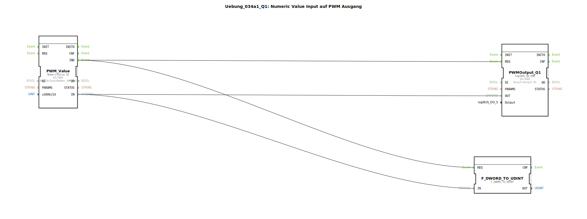

# Uebung_034a1_Q1: Numeric Value Input auf PWM Ausgang

## Übersicht

[cite_start]In dieser Übung wird ein numerischer Wert direkt vom ISOBUS-Terminal eingelesen, um die Tastrate eines PWM-Ausgangs (`Q1`) zu steuern[cite: 1].
Über das Objekt `InputNumber_PWM_Value` kann der Bediener am Bildschirm eine Zahl eingeben. Erst nach der Bestätigung mit "OK" wird das Ereignis `IND` gefeuert und der neue Wert an die PWM-Hardware übertragen. Dies ermöglicht die präzise manuelle Vorgabe von Leistungen (z.B. Lüfterdrehzahl oder Lampenhelligkeit) direkt über das Display.

