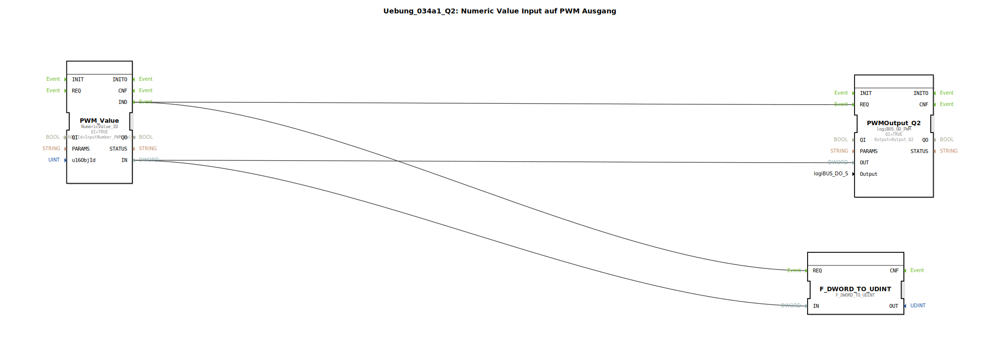

# Uebung_034a1_Q2: Numeric Value Input auf PWM Ausgang

## Übersicht

[cite_start]Variante von Übung 034a1_Q1, konfiguriert für den Hardware-Ausgang `Q2`[cite: 1]. Demonstriert die Skalierbarkeit der PWM-Ansteuerung über das Terminal.

