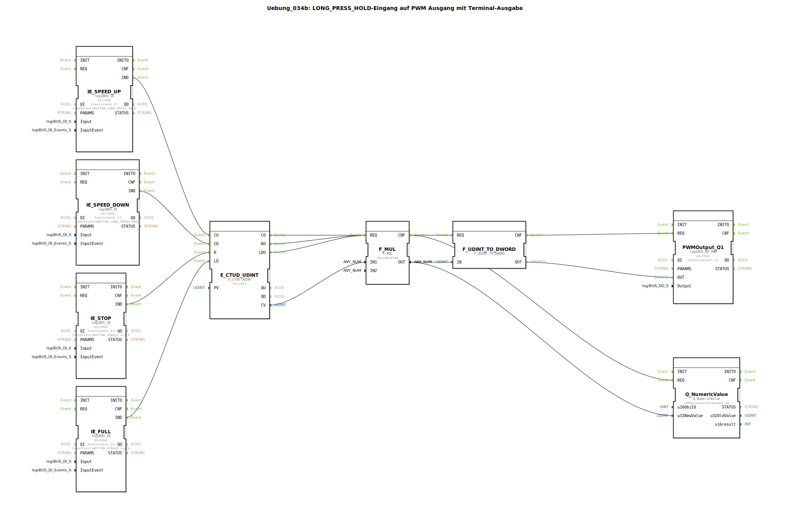

# Uebung_034b: LONG_PRESS_HOLD-Eingang auf PWM Ausgang mit Terminal-Ausgabe

Dieser Artikel beschreibt die logiBUS®-Übung `Uebung_034b`. Hier wird die PWM-Leistung über Taster-Interaktionen ("Gas geben") gesteuert.

----

## Ziel der Übung

Kombination von repetierenden Ereignissen (`HOLD`) und Zählern zur Steuerung einer PWM-Stufe. Der Nutzer kann die Leistung durch Festhalten eines Tasters stufenweise erhöhen oder verringern.

-----

## Beschreibung und Komponenten

[cite_start]In `Uebung_034b.SUB` wird ein Up/Down-Zähler als digitaler Integrator genutzt[cite: 1].

### Funktionsbausteine (FBs)

  * **`IE_SPEED_UP`**: Sendet alle 200ms ein Event, solange Taster **I1** gehalten wird.
  * **`IE_SPEED_DOWN`**: Sendet alle 200ms ein Event, solange Taster **I2** gehalten wird.
  * **`E_CTUD_UDINT`**: Speichert den aktuellen "Leistungs-Zählerstand".
  * **`F_MUL`**: Skaliert den Zählerstand (hier Faktor 8) auf den Zielbereich für den PWM-Baustein.
  * **`PWMOutput_Q1`**: Der Leistungsausgang.

-----

## Funktionsweise

1.  **Steigern**: Der Bediener hält **I1** gedrückt. Der Zähler zählt alle 200ms einen Schritt hoch. Die Lampe an `Q1` wird stufenweise heller.
2.  **Senken**: Der Bediener hält **I2** gedrückt. Die Lampe wird stufenweise dunkler.
3.  **Schnell-Wahl**: Taster **I3** (Stopp) setzt den Wert sofort auf 0. Taster **I4** (Full) lädt den Zähler sofort auf das Maximum.

Dies ermöglicht eine sehr feinfühlige Steuerung von Antrieben oder Beleuchtungen über einfache digitale Taster.