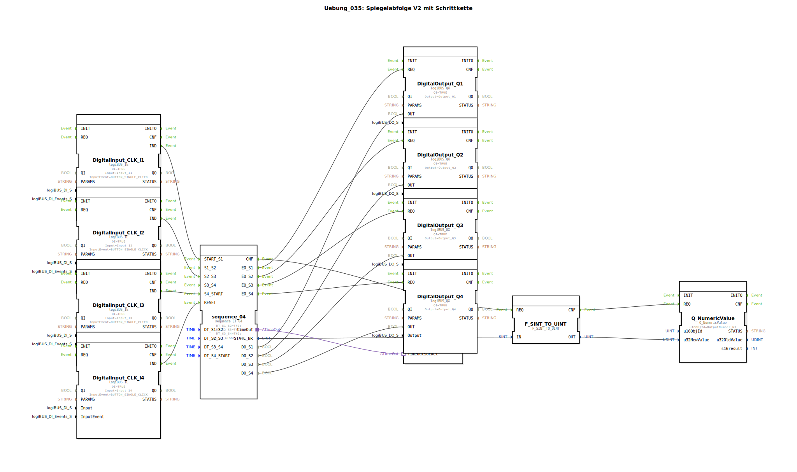

# Uebung_035: Spiegelabfolge V2 mit Schrittkette

Dieser Artikel beschreibt die logiBUS®-Übung `Uebung_035`. Hier wird die Steuerung von komplexen Abläufen mittels eines Sequenzers (Schrittkette) demonstriert.

## 🎧 Podcast

* [Automatisierung entschlüsselt: Leiten, Steuern, Regeln – Die unsichtbare Sprache der Technik (DIN IEC 60050-351)](https://podcasters.spotify.com/pod/show/ms-muc-lama/episodes/Automatisierung-entschlsselt-Leiten--Steuern--Regeln--Die-unsichtbare-Sprache-der-Technik-DIN-IEC-60050-351-e36t52b)
* [Infineon CAN-Transceiver TLE9250V versus TLE9351VSJ](https://podcasters.spotify.com/pod/show/ms-muc-lama/episodes/Infineon-CAN-Transceiver-TLE9250V-versus-TLE9351VSJ-e3b8nan)
* [Infineon TLE9351VSJ der unsichtbare Auto-Bodyguard](https://podcasters.spotify.com/pod/show/ms-muc-lama/episodes/Infineon-TLE9351VSJ-der-unsichtbare-Auto-Bodyguard-e3b8nhl)
* [JBCs Löt-Geheimnis: 350 Grad in 2 Sekunden und warum die Spitze über Effizienz und Lebensdauer entscheidet](https://podcasters.spotify.com/pod/show/ms-muc-lama/episodes/JBCs-Lt-Geheimnis-350-Grad-in-2-Sekunden-und-warum-die-Spitze-ber-Effizienz-und-Lebensdauer-entscheidet-e39arff)

----

## Ziel der Übung

Verwendung des Bausteins `sequence_ET_04`. Es wird gezeigt, wie ein Prozess in vier Phasen (`S1` bis `S4`) unterteilt wird, wobei die Übergänge sowohl durch Ereignisse (Events) als auch durch Zeit (Timer) ausgelöst werden können.

-----

## Beschreibung und Komponenten

[cite_start]Die Subapplikation `Uebung_035.SUB` steuert 4 Ausgänge in einer festen Reihenfolge[cite: 1].

### Funktionsbausteine (FBs)

  * **`sequence_04`**: Der Sequenzer-Baustein. Er verwaltet die Logik der Schritte.
  * **Parameter `DT_S1_S2` etc.**: Definieren die maximale Verweildauer in einem Schritt (hier jeweils 2 Sekunden).
  * **`Q_NumericValue`**: Zeigt den aktuellen Schritt (1-4) auf dem Terminal an.
  * **`E_TimeOut`**: Überwacht den Ablauf.

-----

## Funktionsweise

1.  **Start**: Taster **I1** triggert `START_S1`. Lampe `Q1` geht an.
2.  **Übergang**: Nach 2 Sekunden (oder durch ein Event am entsprechenden Port) springt der Sequenzer zu Schritt 2. `Q1` geht aus, `Q2` geht an.
3.  **Fortsetzung**: Der Prozess läuft bis Schritt 4 durch.
4.  **Reset**: Taster **I4** kann den Ablauf jederzeit abbrechen und alle Ausgänge deaktivieren.

-----

## Anwendungsbeispiel

**Automatischer Reinigungszyklus**:
Ein Knopfdruck startet das Programm: 1. Ventile spülen (2s), 2. Reinigungsmittel einlassen (2s), 3. Einwirken (2s), 4. Klarspülen (2s). Die Schrittkette garantiert, dass die Phasen exakt nacheinander und niemals gleichzeitig ablaufen.