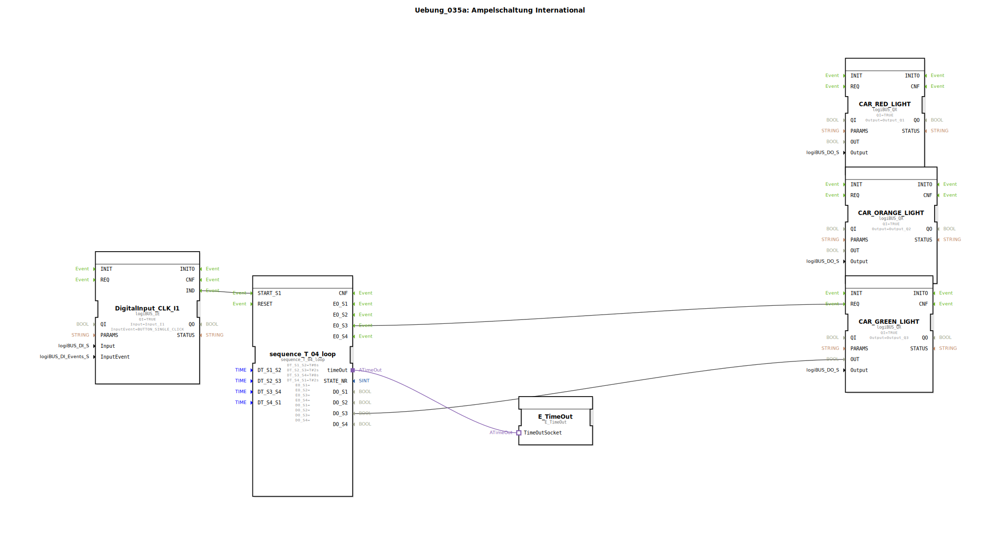

# Uebung_035a: Ampelschaltung International

Dieser Artikel beschreibt die logiBUS®-Übung `Uebung_035a`. Hier wird die Steuerung einer Lichtsignalanlage (Ampel) mittels einer zeitgesteuerten Schrittkette realisiert.

----

## Ziel der Übung

Realisierung eines komplexen Zeitablaufs mit überlappenden Zuständen. Es wird die Standard-Abfolge für Deutschland simuliert: Rot ➡️ Rot-Gelb ➡️ Grün ➡️ Gelb ➡️ Rot.

-----

## Beschreibung und Komponenten

[cite_start]In `Uebung_035a.SUB` wird ein 4-Schritt-Sequenzer als Taktgeber genutzt[cite: 1].

### Funktionsweise

Die Herausforderung liegt in den Misch-Zuständen (z.B. Rot und Gelb leuchten gleichzeitig). Dies wird durch logische ODER-Gatter in Sub-Applikationen (`RED`, `ORANGE`) gelöst:

1.  **Schritt 1 (Rot)**: Nur der Rot-Ausgang ist aktiv (6s).
2.  **Schritt 2 (Rot-Gelb)**: Das Event triggert beide Lampen (2s).
3.  **Schritt 3 (Grün)**: Nur Grün leuchtet (8s).
4.  **Schritt 4 (Gelb)**: Nur Gelb leuchtet (2s).

Danach beginnt der Zyklus von vorn. Dies demonstriert die Kombination von sequenziellem Ablauf und kombinatorischer Logik.