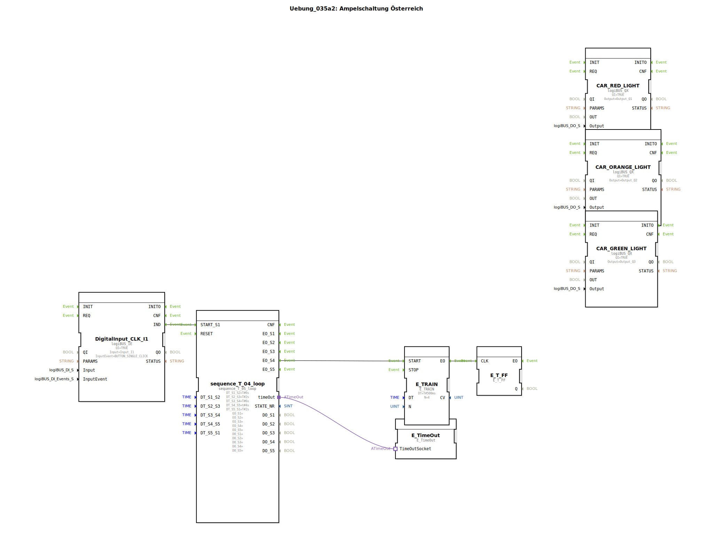

# Uebung_035a2: Ampelschaltung Österreich

Dieser Artikel beschreibt die logiBUS®-Übung `Uebung_035a2`. Hier wird die Ampelsteuerung um die in einigen Ländern (z.B. Österreich) übliche Grün-Blinkphase erweitert.

----

## Übersicht

[cite_start]Unter Verwendung eines 5-Schritt-Sequenzers wird ein zusätzlicher Zustand "Grün Blinken" eingefügt[cite: 1].
Nach der Grünphase (Schritt 3) startet der Sequenzer einen `E_TRAIN` Baustein (Schritt 4). Dieser erzeugt 4 kurze Impulse im 500ms Takt, die über ein Toggle-Flip-Flop die grüne Lampe blinken lassen. Erst nach Abschluss dieser Blink-Sequenz schaltet das System in die Gelbphase (Schritt 5). Dies zeigt die nahtlose Integration von Sub-Sequenzen innerhalb einer übergeordneten Schrittkette.

