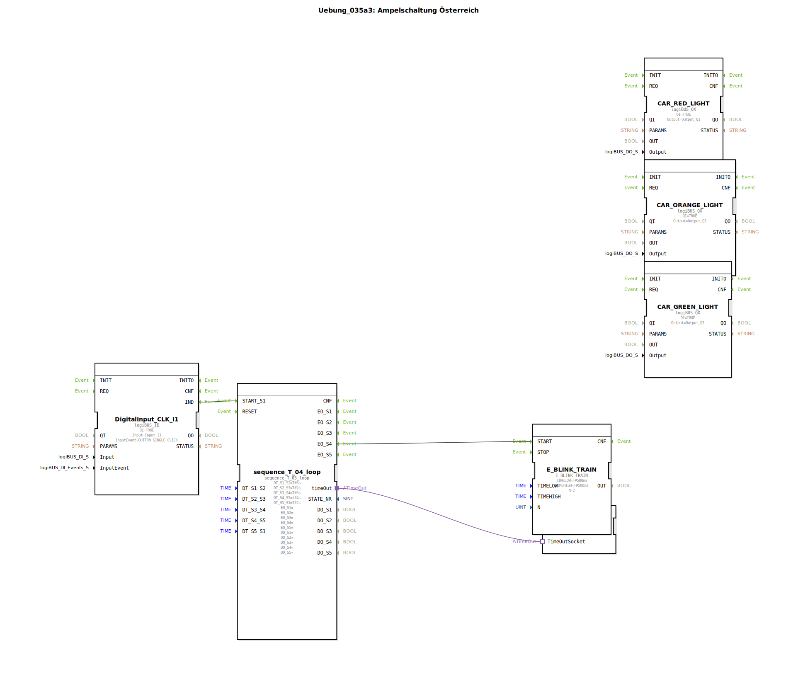

# Uebung_035a3: Ampelschaltung Österreich

## Übersicht

[cite_start]Strukturelle Variante der Übung 035a2[cite: 1]. Anstelle des `E_TRAIN` Bausteins wird hier der spezialisierte `E_BLINK_TRAIN` genutzt, um die Grün-Blinkphase noch präziser zu steuern. Die Logik der Zustandsüberlappung (Rot-Gelb) wird weiterhin über Sub-Applikations-ODER-Gatter realisiert.

