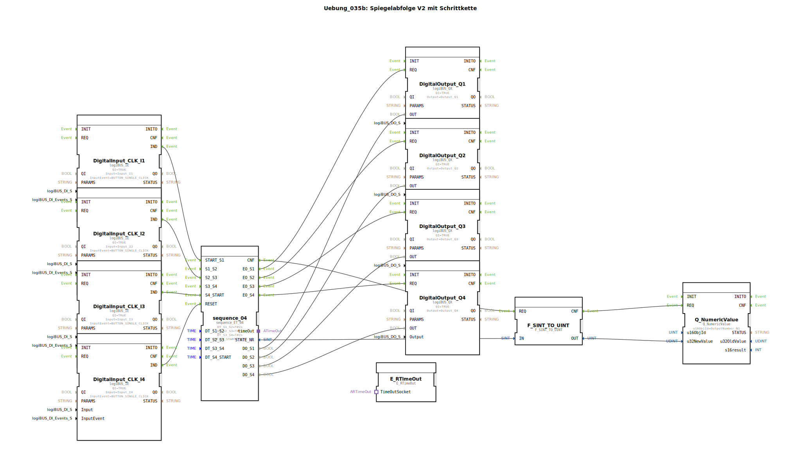

Hier ist die Dokumentation für die Übung **Uebung_035b** basierend auf den bereitgestellten XML-Daten.

# Uebung_035b: Spiegelabfolge V2 mit Schrittkette

* * * * * * * * * *

## Einleitung
In dieser Übung wird eine Schrittkettensteuerung (Sequencer) realisiert, die als "Spiegelabfolge V2" bezeichnet wird. Das Ziel ist die sequentielle Ansteuerung von vier digitalen Ausgängen (Q1 bis Q4). Zusätzlich wird der aktuelle Status der Schrittkette als numerischer Wert auf einer Benutzeroberfläche visualisiert. Die Steuerung erfolgt über digitale Eingänge, welche die Sequenz starten, beeinflussen oder zurücksetzen können.

## Verwendete Funktionsbausteine (FBs)

In dieser Anwendung werden verschiedene Funktionsbausteine aus den Bibliotheken `logiBUS`, `isobus` und `iec61131` verwendet.

### Haupt-Bausteine
*   **DigitalInput_CLK_I1** bis **DigitalInput_CLK_I4** (`logiBUS::io::DI::logiBUS_IE`): Diese Bausteine verarbeiten die physischen Eingabesignale (Taster). Sie sind so konfiguriert, dass sie auf das Ereignis `BUTTON_SINGLE_CLICK` reagieren.
*   **DigitalOutput_Q1** bis **DigitalOutput_Q4** (`logiBUS::io::DQ::logiBUS_QX`): Diese Bausteine steuern die physischen Ausgänge (Lampen/Aktoren).
*   **Q_NumericValue** (`isobus::UT::Q::Q_NumericValue`): Dient zur Anzeige eines numerischen Wertes auf einem Universal Terminal (UT). Hier wird die Objekt-ID `OutputNumber_N1` verwendet.
*   **F_SINT_TO_UINT** (`iec61131::conversion::F_SINT_TO_UINT`): Ein Konvertierungsbaustein, der den Datentyp Short Integer (SINT) in Unsigned Integer (UINT) umwandelt, um ihn kompatibel für die Anzeige zu machen.
*   **E_RTimeOut** (`iec61499::events::E_RTimeOut`): *Hinweis: Dieser Baustein ist im Netzwerk platziert, aber im aktuellen Stand der Übung nicht verdrahtet (laut Kommentar ein "TODO" für ein zukünftiges Beispiel).*

### Sub-Bausteine: sequence_ET_04
Dies ist der zentrale Logikbaustein der Übung.

*   **Typ**: `logiBUS::utils::sequence::combi::sequence_ET_04`
*   **Beschreibung**: Eine Schrittkette mit 4 Schritten, die Zeit- und Ereignisgesteuert arbeitet.
*   **Parameter**:
    *   `DT_S1_S2` = `T#2s`: Zeitdauer/Verzögerung zwischen Schritt 1 und 2.
    *   `DT_S2_S3` = `T#2s`: Zeitdauer/Verzögerung zwischen Schritt 2 und 3.
    *   `DT_S3_S4` = `T#2s`: Zeitdauer/Verzögerung zwischen Schritt 3 und 4.
    *   `DT_S4_START` = `T#2s`: Zeitdauer/Verzögerung nach Schritt 4 bis zum Neustart.
*   **Ereigniseingänge (Verwendet)**:
    *   `START_S1`: Startet die Sequenz bei Schritt 1.
    *   `S2_S3`: Trigger für den Übergang oder Einfluss auf den Schrittwechsel 2 zu 3.
    *   `S4_START`: Trigger für den Übergang oder Einfluss auf den Schrittwechsel 4 zurück zum Start.
    *   `RESET`: Setzt die Schrittkette zurück.
*   **Ausgänge**:
    *   `EO_S1` bis `EO_S4`: Ereignisausgänge, die feuern, wenn der jeweilige Schritt aktiv wird.
    *   `DO_S1` bis `DO_S4`: Datenausgänge (BOOL), die den Status des jeweiligen Schritts führen.
    *   `STATE_NR`: Gibt die aktuelle Schrittnummer als Zahl aus.

## Programmablauf und Verbindungen

Der Ablauf der Übung wird durch die Interaktion der Taster mit dem Sequencer-Baustein bestimmt:

1.  **Steuerung der Sequenz**:
    *   Der Taster **I1** ist mit dem Eingang `START_S1` verbunden. Ein Klick startet die Schrittkette.
    *   Der Taster **I2** greift in den Übergang `S2_S3` ein.
    *   Der Taster **I3** greift in den Übergang `S4_START` ein.
    *   Der Taster **I4** ist mit dem `RESET`-Eingang verbunden und stoppt/resettet die gesamte Sequenz.

2.  **Ausgabe der Signale**:
    *   Der Sequencer `sequence_04` schaltet je nach aktivem Schritt die Ausgänge:
        *   Schritt 1 aktiviert **Q1**.
        *   Schritt 2 aktiviert **Q2**.
        *   Schritt 3 aktiviert **Q3**.
        *   Schritt 4 aktiviert **Q4**.
    *   Die Zeitparameter (T#2s) im Sequencer deuten darauf hin, dass die Schritte eine definierte Laufzeit haben oder automatische Übergänge nach 2 Sekunden stattfinden, sofern sie nicht durch die Eingänge übersteuert werden.

3.  **Visualisierung**:
    *   Die aktuelle Schrittnummer (`STATE_NR` vom Sequencer) wird an den Konverter `F_SINT_TO_UINT` gesendet.
    *   Der konvertierte Wert (`u32NewValue`) wird an den Baustein `Q_NumericValue` übergeben, um die Nummer des aktiven Schritts auf dem Display (Objekt `OutputNumber_N1`) anzuzeigen.

## Zusammenfassung

Die Übung **Uebung_035b** demonstriert die Implementierung einer komplexeren Schrittkettensteuerung (`sequence_ET_04`) innerhalb der 4diac-IDE. Sie verknüpft manuelle Benutzereingaben (Start, Reset, spezifische Übergangstrigger) mit zeitbasierten Parametern, um vier Ausgänge sequenziell zu schalten. Gleichzeitig wird der interne Zustand der Logik (die Schrittnummer) für den Benutzer auf einem Display visualisiert.