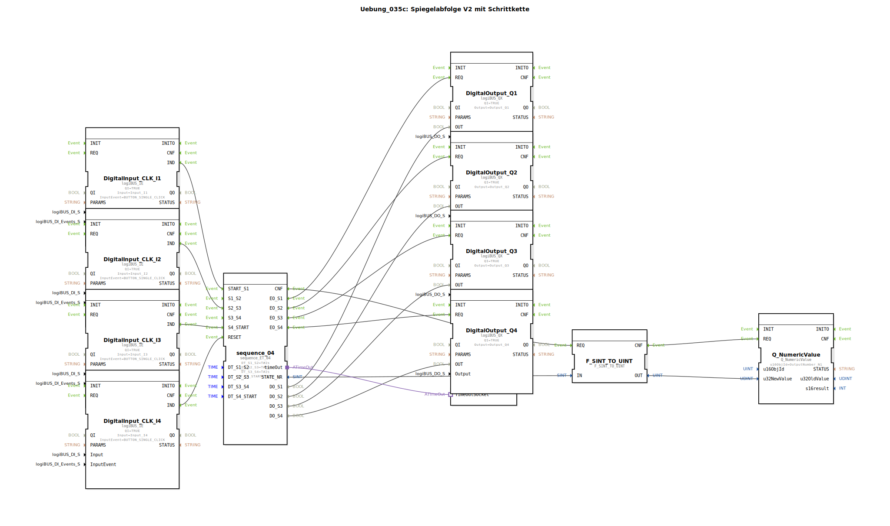

Hier ist die Dokumentation für die Übung **Uebung_035c** im gewünschten Format.

# Uebung_035c: Spiegelabfolge V2 mit Schrittkette

*(Hier Bild der Übung einfügen, falls vorhanden)*

* * * * * * * * * *

## Einleitung
Die Übung **Uebung_035c** („Spiegelabfolge V2 mit Schrittkette“) demonstriert die Steuerung einer sequenziellen Abfolge (Schrittkette) mit vier Zuständen. Dabei kommen sowohl zeitgesteuerte als auch ereignisgesteuerte Übergänge zum Einsatz. Der aktuelle Status der Schrittkette wird über digitale Ausgänge (LEDs) visualisiert und die Nummer des aktiven Schritts wird auf einer numerischen Anzeige ausgegeben.

## Verwendete Funktionsbausteine (FBs)

In dieser Übung werden verschiedene Standard- und Logikbausteine verwendet, um die Ein- und Ausgabe sowie die Ablaufsteuerung zu realisieren.

### Haupt-Bausteine

*   **DigitalInput_CLK_I1 bis I4** (`logiBUS::io::DI::logiBUS_IE`):
    *   Dienen zum Einlesen der Taster-Signale (Input_I1 bis Input_I4).
    *   Konfiguriert auf das Ereignis `BUTTON_SINGLE_CLICK`.
*   **DigitalOutput_Q1 bis Q4** (`logiBUS::io::DQ::logiBUS_QX`):
    *   Steuern die physikalischen Ausgänge (Output_Q1 bis Output_Q4) an, um den aktiven Schritt anzuzeigen.
*   **Q_NumericValue** (`isobus::UT::Q::Q_NumericValue`):
    *   Dient zur Visualisierung eines numerischen Wertes auf dem Display (Objekt-ID `OutputNumber_N1`).
*   **F_SINT_TO_UINT** (`iec61131::conversion::F_SINT_TO_UINT`):
    *   Konvertiert die Schrittnummer (SINT) in einen vorzeichenlosen Integer (UINT), damit dieser vom `Q_NumericValue` Baustein verarbeitet werden kann.
*   **E_TimeOut** (`iec61499::events::E_TimeOut`):
    *   Ein Systembaustein für Zeitfunktionen, der über einen Adapter mit der Schrittkette verbunden ist.

### Sub-Bausteine: sequence_04

Dieser Baustein ist das Herzstück der logischen Steuerung.

*   **Typ**: `logiBUS::utils::sequence::combi::sequence_ET_04`
*   **Verwendete interne FBs**: (Logik kapselt eine Zustandsmaschine mit Zeitgliedern)
    *   **Parameter**:
        *   `DT_S1_S2` = `T#2s`: Verzögerungszeit für den Übergang von Schritt 1 zu 2.
        *   `DT_S2_S3` = `T#2s`: Verzögerungszeit für den Übergang von Schritt 2 zu 3.
        *   `DT_S3_S4` = `T#2s`: Verzögerungszeit für den Übergang von Schritt 3 zu 4.
        *   `DT_S4_START` = `T#2s`: Verzögerungszeit für den Rücksprung zum Start.
    *   **Ereigniseingänge**:
        *   `START_S1`: Startet die Sequenz bei Schritt 1 (verbunden mit Taster I1).
        *   `S2_S3`: Trigger für den Übergang von Schritt 2 zu 3 (verbunden mit Taster I2).
        *   `S4_START`: Trigger für den Neustart nach Schritt 4 (verbunden mit Taster I3).
        *   `RESET`: Setzt die Kette zurück (verbunden mit Taster I4).
    *   **Datenausgänge**:
        *   `DO_S1` bis `DO_S4`: Statussignale für die Ausgänge Q1 bis Q4.
        *   `STATE_NR`: Gibt die aktuelle Schrittnummer als Zahl aus.

## Programmablauf und Verbindungen

Die Logik kombiniert automatische Zeitübergänge mit manuellen Benutzereingriffen.

1.  **Starten der Sequenz**:
    *   Durch Betätigen von **Taster I1** wird das Ereignis `START_S1` ausgelöst.
    *   Die Schrittkette springt in **Zustand 1**.
    *   Der Ausgang **Q1** wird aktiviert.

2.  **Automatische und Manuelle Übergänge**:
    *   **S1 -> S2**: Da kein explizites Ereignis für diesen Übergang verdrahtet ist, erfolgt der Wechsel zu **Zustand 2** (Q2 an) automatisch nach Ablauf der Zeit `DT_S1_S2` (2 Sekunden).
    *   **S2 -> S3**: Der Übergang zu **Zustand 3** (Q3 an) erfordert eine manuelle Bestätigung durch **Taster I2**, da dieser am Eingang `S2_S3` angeschlossen ist. Die Zeit `DT_S2_S3` dient hierbei vermutlich als Mindestwartezeit oder Timeout-Basis.
    *   **S3 -> S4**: Der Wechsel zu **Zustand 4** (Q4 an) erfolgt wieder automatisch nach Ablauf von `DT_S3_S4` (2 Sekunden), da kein Taster-Event angeschlossen ist.
    *   **S4 -> Start**: Um die Kette von Zustand 4 wieder neu zu starten, muss **Taster I3** betätigt werden (Eingang `S4_START`).

3.  **Visualisierung**:
    *   Parallel zu den LEDs wird die aktuelle Schrittnummer (`STATE_NR`) über den Konverter an den Baustein `Q_NumericValue` gesendet und auf dem Display (OutputNumber_N1) angezeigt.

4.  **Reset**:
    *   Der **Taster I4** ist mit dem `RESET`-Eingang verbunden und setzt die gesamte Schrittkette jederzeit in den Grundzustand zurück (alle Ausgänge aus).

## Zusammenfassung

Diese Übung vertieft das Verständnis für komplexe Schrittketten in IEC 61499. Sie zeigt auf, wie manuelle Eingriffe (Trigger durch Taster) mit automatischen Zeitabläufen gemischt werden können. Zudem wird die Verarbeitung von numerischen Daten zur Zustandsanzeige und die Konvertierung von Datentypen (`SINT_TO_UINT`) praktisch angewendet.