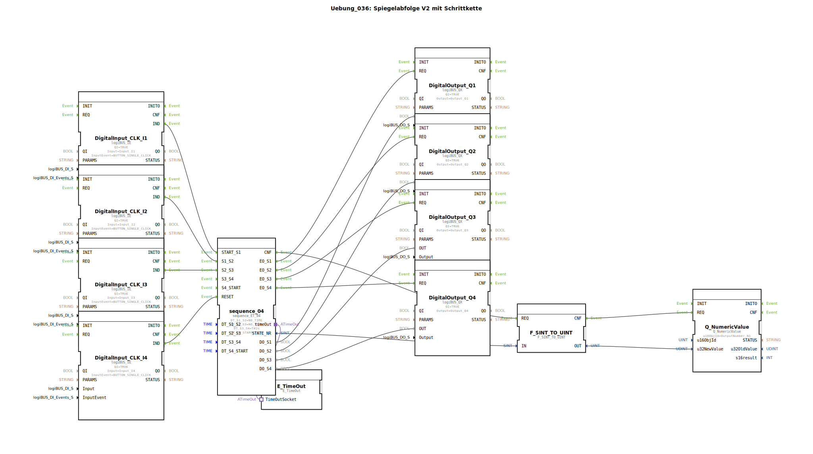

# Uebung_036: Spiegelabfolge V2 mit Schrittkette

Dieser Artikel beschreibt die logiBUS®-Übung `Uebung_036`. Im Gegensatz zu Übung 035 liegt hier der Fokus auf der manuellen Weiterschaltung durch Ereignisse.

----

## Ziel der Übung

Realisierung einer Schrittkette ohne automatische Zeitübergänge.

-----

## Funktionsweise

[cite_start]In `Uebung_036.SUB` sind die Zeitparameter `DT_S1_S2` und `DT_S2_S3` auf den Wert `NO_TIME` gesetzt[cite: 1].

Das bedeutet: Der Sequenzer bleibt in Schritt 1 stehen, bis er ein explizites Ereignis am Eingang `S1_S2` erhält. In dieser Übung wird dies durch den Taster **I2** ausgelöst. Analog schaltet Taster **I3** von Schritt 2 zu 3 weiter. Erst die letzten Schritte nutzen wieder die Zeitautomatik (2s).

-----

## Anwendungsbeispiel

**Manueller Bestückungsprozess**:
Ein Mitarbeiter legt ein Teil ein und drückt "Fertig" (`I2`). Die Maschine führt den ersten Bearbeitungsschritt aus. Danach wartet sie wieder auf die Freigabe des Mitarbeiters (`I3`), bevor sie weitermacht. Die Schrittkette passt sich so dem Arbeitstempo des Menschen an.