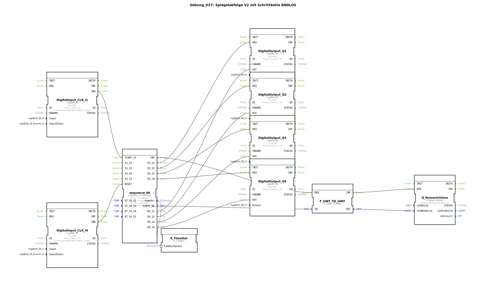

# Uebung_037: Spiegelabfolge V2 mit Schrittkette ENDLOS

Dieser Artikel beschreibt die logiBUS®-Übung `Uebung_037`. Hier wird eine zyklisch wiederkehrende Abfolge programmiert.

----

## Übersicht

[cite_start]Diese Übung nutzt den Baustein `sequence_ET_04_loop`[cite: 1]. Sobald die Sequenz durch Taster **I1** gestartet wurde, durchläuft sie permanent die Schritte 1 bis 4. Nach Abschluss von Schritt 4 springt sie automatisch wieder zu Schritt 1 zurück. Erst durch den Reset-Taster **I4** wird der Kreislauf unterbrochen und die Maschine gestoppt. Dies ist ideal für Dauerläufe oder periodische mechanische Bewegungen.