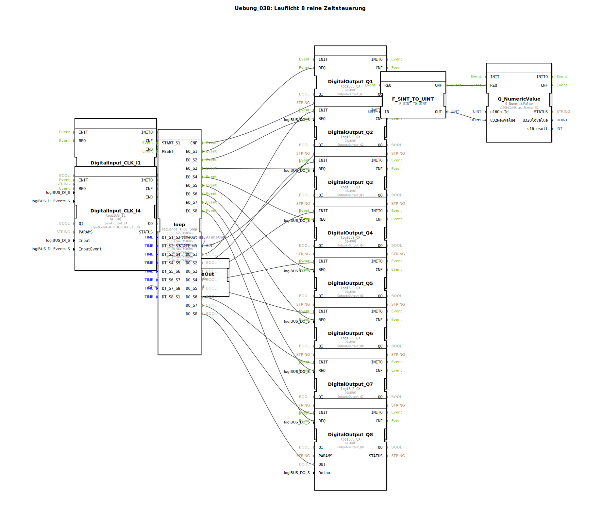

# Uebung_038: Lauflicht 8 reine Zeitsteuerung

Dieser Artikel beschreibt die logiBUS®-Übung `Uebung_038`. Hier wird eine umfangreichere Schrittkette mit 8 Phasen realisiert.

----

## Übersicht

[cite_start]Unter Verwendung des Bausteins `sequence_T_08_loop` wird ein automatisches Lauflicht über 8 Ausgänge (`Q1` bis `Q8`) erzeugt[cite: 1].
Die Übergangszeiten zwischen den Lampen sind individuell einstellbar (z.B. 200ms für die ungeraden, 100ms für die geraden Schritte). Das Programm demonstriert die Handhabung vieler paralleler Ausgänge und die numerische Rückmeldung des aktuellen Systemzustands an das Terminal.

