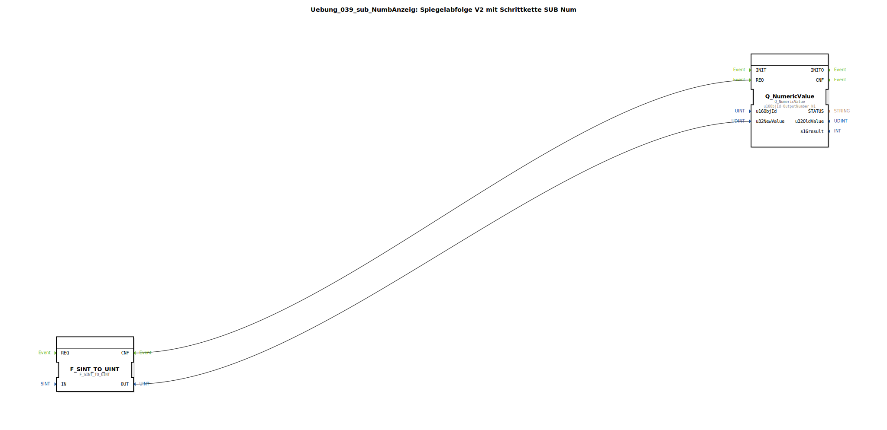

Hier ist die generierte Dokumentation basierend auf dem bereitgestellten XML-Code:

# Uebung_039_sub_NumbAnzeig: Spiegelabfolge V2 mit Schrittkette SUB Num

* * * * * * * * * *

## Einleitung
Die Sub-Applikation **Uebung_039_sub_NumbAnzeig** ist eine Hilfskomponente, die für die Anzeige von numerischen Werten im Kontext einer Schrittkette (Spiegelabfolge V2) konzipiert wurde. Ihre Hauptaufgabe besteht darin, eine Statusnummer (`STATE_NR`) entgegenzunehmen, diese in ein passendes Datenformat zu konvertieren und anschließend an ein Ausgabeelement (ISOBUS Universal Terminal) zu senden.

## Verwendete Funktionsbausteine (FBs)

In dieser Übung wird ein Sub-Baustein definiert, der intern Standard-Konvertierungsbausteine sowie ISOBUS-Kommunikationsbausteine verwendet.

### Sub-Bausteine: Uebung_039_sub_NumbAnzeig
- **Typ**: SubAppType
- **Beschreibung**: Spiegelabfolge V2 mit Schrittkette SUB Num
- **Verwendete interne FBs**:
    - **F_SINT_TO_UINT**: `iec61131::conversion::F_SINT_TO_UINT`
        - **Funktion**: Konvertiert einen `SINT` (Short Integer) Wert in einen `UINT` (Unsigned Integer) Wert.
        - **Dateneingang**: `IN` (Verbunden mit dem externen Eingang `STATE_NR`)
        - **Datenausgang**: `OUT` (Liefert den konvertierten Wert an `Q_NumericValue`)
        - **Ereigniseingang**: `REQ` (Ausgelöst durch das externe `CNF` Ereignis)
        - **Ereignisausgang**: `CNF` (Trigger für `Q_NumericValue`)

    - **Q_NumericValue**: `isobus::UT::Q::Q_NumericValue`
        - **Funktion**: Aktualisiert einen numerischen Wert auf einem ISOBUS-Terminal.
        - **Parameter**: `u16ObjId` = `OutputNumber_N1` (Referenz auf das spezifische Anzeigeobjekt)
        - **Dateneingang**: `u32NewValue` (Empfängt den konvertierten Wert von `F_SINT_TO_UINT`)
        - **Ereigniseingang**: `REQ` (Trigger zur Aktualisierung des Werts)

- **Funktionsweise**:
    Der Sub-Baustein nimmt eine vorzeichenbehaftete Ganzzahl (`SINT`) entgegen, wandelt diese in eine vorzeichenlose Ganzzahl (`UINT`) um, da das Zielobjekt (Numeric Value) dieses Format erwartet, und sendet den Wert an das definierte Oberflächenobjekt `OutputNumber_N1`.

## Programmablauf und Verbindungen

Der Ablauf innerhalb dieses Sub-Bausteins ist streng linear und ereignisgesteuert:

1.  **Eingangssignal**:
    Die Verarbeitung beginnt, wenn von außen das Ereignis `CNF` am Sub-Baustein anliegt. Gleichzeitig wird der Wert für `STATE_NR` (die aktuelle Schrittnummer) übergeben.

2.  **Datenkonvertierung**:
    Das Ereignis wird an den Baustein `F_SINT_TO_UINT` weitergeleitet. Dieser liest den Wert von `STATE_NR`, wandelt ihn in das `UINT`-Format um und stellt das Ergebnis an seinem Ausgang `OUT` bereit.

3.  **Anzeige-Update**:
    Sobald die Konvertierung bestätigt ist (Event `CNF` von `F_SINT_TO_UINT`), wird der Baustein `Q_NumericValue` aktiviert.
    *   Er übernimmt den konvertierten Wert am Eingang `u32NewValue`.
    *   Der Parameter `u16ObjId` ist fest auf `OutputNumber_N1` eingestellt, was bedeutet, dass genau dieses Feld auf der Benutzeroberfläche aktualisiert wird.

**Verbindungsübersicht:**
*   **Event**: `CNF` (Input) &rarr; `F_SINT_TO_UINT.REQ` &rarr; `F_SINT_TO_UINT.CNF` &rarr; `Q_NumericValue.REQ`.
*   **Daten**: `STATE_NR` (Input) &rarr; `F_SINT_TO_UINT.IN` &rarr; `F_SINT_TO_UINT.OUT` &rarr; `Q_NumericValue.u32NewValue`.

## Zusammenfassung
Die Übung **Uebung_039_sub_NumbAnzeig** demonstriert die Kapselung von Logik in einer Sub-Applikation. Sie dient als Schnittstelle zwischen der Steuerungslogik (Schrittkette) und der Visualisierung (ISOBUS-Terminal), indem sie Datentypen anpasst und die Kommunikation mit dem Ausgabeobjekt `OutputNumber_N1` übernimmt. Dies fördert die Wiederverwendbarkeit und Übersichtlichkeit im Hauptprogramm.

## 🛠️ Zugehörige Übungen

* [Uebung_039](Uebung_039.md)
* [Uebung_039a](Uebung_039a.md)

