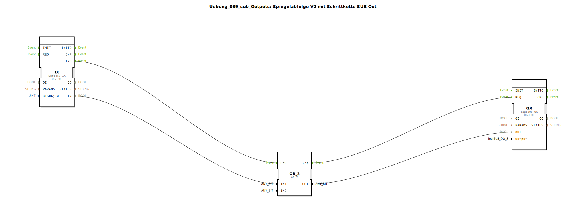

Hier ist die Dokumentationsseite für die bereitgestellte Übungsdatei.

# Uebung_039_sub_Outputs: Spiegelabfolge V2 mit Schrittkette SUB Out

*(Platzhalter für Bild der Übung)*

* * * * * * * * * *

## Einleitung

Diese Dokumentation beschreibt die Sub-Applikation `Uebung_039_sub_Outputs`. Dieser Baustein ist Teil einer komplexeren Steuerung (vermutlich "Spiegelabfolge V2 mit Schrittkette") und dient als Schnittstelle zwischen der Steuerungslogik, der Hardware und der Benutzeroberfläche (ISOBUS VT). 

Der Hauptzweck dieses Moduls ist die Ansteuerung eines digitalen Ausgangs, wobei zwei Quellen das Signal aktivieren können: ein automatisches Signal aus dem Programm oder eine manuelle Betätigung über einen Softkey auf dem Terminal. Zusätzlich wird der Status visuell zurückgemeldet.

## Verwendete Funktionsbausteine (FBs)

In dieser Sub-Applikation werden verschiedene Funktionsbausteine verschaltet, um die Eingabe-, Logik- und Ausgabefunktionen zu realisieren.

### Sub-Bausteine: Uebung_039_sub_Outputs

Dieser Baustein kapselt die Logik für einen einzelnen Aktor/Ausgang.

- **Typ**: SubAppType
- **Verwendete interne FBs**:

    - **QX**: `logiBUS::io::DQ::logiBUS_QX`
        - **Beschreibung**: Treiberbaustein für einen physikalischen digitalen Ausgang am logiBUS.
        - **Parameter**: `QI` = `TRUE` (Baustein ist aktiviert).
        - **Dateneingang**: 
            - `Output`: Verbunden mit dem externen Eingang `Output` (definiert die Hardware-Adresse).
            - `OUT`: Erhält das Schaltsignal vom `OR_2`-Baustein.
        - **Ereigniseingang**: `REQ` (Trigger zur Aktualisierung des Ausgangs).

    - **IX**: `isobus::UT::io::Softkey::Softkey_IX`
        - **Beschreibung**: Eingangsbaustein zum Lesen eines Softkeys (Taste) auf einem ISOBUS-Terminal.
        - **Parameter**: `QI` = `TRUE`.
        - **Dateneingang**: `u16ObjId` (Objekt-ID des Softkeys).
        - **Datenausgang**: `IN` (Aktueller Status der Taste).
        - **Ereignisausgang**: `IND` (Indication - Signalisiert Statusänderung/Aktualisierung).

    - **OR_2**: `iec61131::bitwiseOperators::OR_2`
        - **Beschreibung**: Logisches ODER-Gatter.
        - **Dateneingang**: 
            - `IN1`: Verbunden mit `IX.IN` (Softkey-Status).
            - `IN2`: Verbunden mit dem externen Eingang `OUT` (Steuersignal).
        - **Funktionsweise**: Der Ausgang wird TRUE, wenn entweder der Softkey gedrückt wird ODER das externe Steuersignal anliegt.

    - **GreenWhiteBackground**: `MyLib::sys::GreenWhiteBackground`
        - **Beschreibung**: Eine weitere Sub-Applikation (vermutlich zur Visualisierung), die den Hintergrund des Softkeys steuert (z.B. Grün bei Aktivität, Weiß bei Inaktivität).
        - **Dateneingang**: 
            - `DI1`: Verbunden mit dem Ergebnis der ODER-Logik (`OR_2.OUT`).
            - `u16ObjId`: Die ID des zu färbenden Objekts.

- **Funktionsweise**:
    Der Baustein fasst Hardware-Ansteuerung und HMI-Interaktion zusammen. Er prüft kontinuierlich, ob eine Anforderung vorliegt, den Ausgang zu setzen. Dies geschieht durch die Verknüpfung des manuellen Eingriffs (Softkey `IX`) und der automatischen Anforderung (`OUT`). Das Ergebnis wird direkt auf die Hardware geschrieben (`QX`) und gleichzeitig zur Visualisierung genutzt (`GreenWhiteBackground`).

## Programmablauf und Verbindungen

Der Daten- und Ereignisfluss innerhalb der Sub-Applikation gestaltet sich wie folgt:

1.  **Initialisierung und Trigger**:
    *   Der Baustein reagiert auf das Ereignis `REQ` von außen oder auf ein `IND`-Ereignis des Softkeys (`IX`).
    *   Die Objekt-ID für den Softkey (`u16ObjId`) und die Hardware-Adresse (`Output`) werden von außen in die internen Bausteine `IX`, `QX` und `GreenWhiteBackground` durchgeleitet.

2.  **Logische Verknüpfung (OR)**:
    *   Der Baustein `OR_2` nimmt zwei boolesche Signale entgegen:
        *   `IN1`: Den Status des Softkeys (`IX.IN`).
        *   `IN2`: Den externen Eingang `OUT` (z.B. von einer Schrittkette).
    *   Sobald eines dieser Signale `TRUE` ist, schaltet der Ausgang des `OR_2` auf `TRUE`. Dies ermöglicht eine "Oder-Schaltung": Der Aktor läuft, wenn die Automatik es will **oder** der Bediener die Taste drückt.

3.  **Ausgabe und Feedback**:
    *   Das Ergebnis der ODER-Verknüpfung triggert den Hardware-Ausgang `QX`.
    *   Gleichzeitig wird das Ergebnis an die Sub-Applikation `GreenWhiteBackground` weitergegeben. Sobald der Hardware-Ausgang aktiv ist (durch `QX.CNF` bestätigt), wird die Visualisierung aktualisiert (wahrscheinlich wird der Softkey grün hinterlegt).

## Zusammenfassung

Die Übung bzw. der Baustein `Uebung_039_sub_Outputs` stellt ein robustes Modul zur Aktorsteuerung dar. Es demonstriert, wie man in 4diac eine logische Entkopplung von Automatik- und Handbetrieb realisiert und diese direkt mit physikalischer Hardware und einer Benutzeroberfläche verknüpft. Durch die Kapselung in einer Sub-Applikation kann dieser Baustein mehrfach instanziiert werden, um verschiedene Ausgänge einer Maschine (z.B. in einer Spiegelabfolge) identisch anzusteuern.