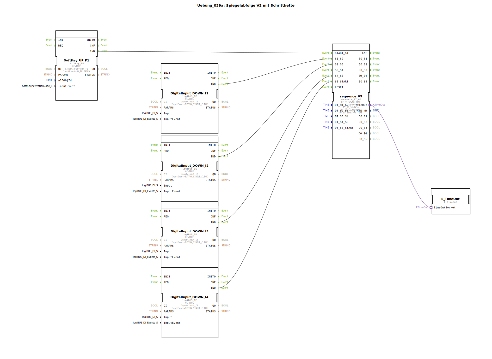

# Uebung_039a: Spiegelabfolge V2 mit Schrittkette

## Übersicht

[cite_start]Diese Übung ist eine Spezialisierung der Ventilsteuerung für Systeme mit 3/2-Wege-Ventilen (z.B. hydraulische Ringsysteme wie bei Claas)[cite: 1].
Die Schrittkette (`sequence_ET_05`) verwaltet den Ablauf der Zylinderbewegungen. Die Ansteuerung der physischen Ausgänge erfolgt über die Sub-App `Uebung_039a_sub_Outputs`, die zusätzlich ein direktes visuelles Feedback auf dem ISOBUS-Softkey liefert. Dies demonstriert die Anpassbarkeit der logiBUS-Sequenz-Bausteine an verschiedene hydraulische Verschaltungskonzepte.

