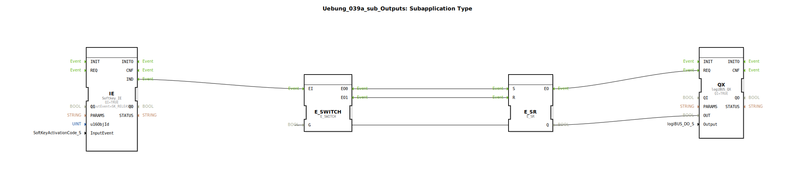

Hier ist die Dokumentation für die Übung basierend auf den bereitgestellten XML-Daten.

# Uebung_039a_sub_Outputs: Subapplication Type

![Bild der Übung, falls vorhanden]

* * * * * * * * * *

## Einleitung

Die **Uebung_039a_sub_Outputs** ist ein Sub-Applikations-Typ, der dafür konzipiert ist, einen digitalen Ausgang (LogiBUS Output) über einen ISOBUS-Softkey zu steuern. Die Logik beinhaltet eine Umschaltfunktion (Toggle) beim Drücken des Softkeys, visuelles Feedback durch Hintergrundfarbenänderung am Terminal sowie externe Setz- und Rücksetz-Möglichkeiten.

## Verwendete Funktionsbausteine (FBs)

In dieser Sub-Applikation werden verschiedene Funktionsbausteine und eine weitere Sub-Applikation verwendet, um die Steuerungslogik und die visuelle Rückmeldung zu realisieren.

### Sub-Bausteine: GreenWhiteBackground
Diese Sub-Applikation wird verwendet, um den Status des Ausgangs visuell auf dem Display darzustellen.

- **Typ**: `MyLib::sys::GreenWhiteBackground`
- **Verwendete interne FBs**:
    - *Hinweis: Da der interne Code dieses Bausteins hier nicht vorliegt, basiert die Beschreibung auf der Verschaltung.*
- **Funktionsweise**: 
    Dieser Baustein empfängt eine Objekt-ID (`u16ObjId`) und einen digitalen Status (`DI1`). Wenn der Ausgang geschaltet wird (Trigger über `REQ`), ändert dieser Baustein wahrscheinlich die Hintergrundfarbe des entsprechenden UI-Objekts (z.B. Grün für aktiv, Weiß für inaktiv).

### Weitere Bausteine

#### IE (Softkey Input Event)
- **Typ**: `isobus::UT::io::Softkey::Softkey_IE`
- **Parameter**: 
    - `QI` = `TRUE`
    - `InputEvent` = `SK_RELEASED` (Reagiert auf das Loslassen der Taste)
    - `u16ObjId` = Verbunden mit dem Eingang `u16ObjId`
- **Funktionsweise**: Überwacht einen spezifischen ISOBUS-Softkey. Wenn dieser losgelassen wird, sendet der Baustein ein Event am Ausgang `IND`.

#### E_SWITCH (Event Switch)
- **Typ**: `iec61499::events::E_SWITCH`
- **Funktionsweise**: Fungiert als Weiche für Events. Abhängig vom Eingang `G` wird das eingehende Event `EI` entweder auf `EO0` (wenn G=0) oder `EO1` (wenn G=1) geleitet. Dies ist zentral für die Toggle-Logik.

#### E_SR (Set/Reset Flip-Flop)
- **Typ**: `iec61499::events::E_SR`
- **Funktionsweise**: Ein bistabiles Element, das den Zustand (Ein/Aus) speichert. Ein Event an `S` setzt den Ausgang `Q` auf TRUE, ein Event an `R` setzt ihn auf FALSE.

#### QX (LogiBUS Output)
- **Typ**: `logiBUS::io::DQ::logiBUS_QX`
- **Parameter**: `QI` = `TRUE`
- **Funktionsweise**: Dieser Baustein steuert den physikalischen oder logischen Ausgang des LogiBUS-Systems. Er übernimmt den Zustand von `OUT` und schreibt ihn auf die Variable, die am Dateneingang `Output` definiert ist.

## Programmablauf und Verbindungen

Der Ablauf innerhalb dieser Sub-Applikation lässt sich wie folgt beschreiben:

1.  **Initialisierung**: Die Sub-Applikation erhält von außen eine `u16ObjId` (welche Taste/welches UI-Element gesteuert wird) und eine Referenz auf einen physikalischen `Output`.
2.  **Benutzerinteraktion (Toggle-Logik)**:
    *   Wenn der Benutzer den entsprechenden Softkey drückt und loslässt, feuert der Baustein **IE** ein Event.
    *   Dieses Event gelangt zum **E_SWITCH**.
    *   Der **E_SWITCH** prüft den aktuellen Zustand des Systems (Rückkopplung von **E_SR.Q** auf **E_SWITCH.G**).
    *   Ist der Ausgang aktuell AUS (Q=FALSE), wird das Event an den **Set**-Eingang des **E_SR** geleitet -> Der Ausgang wird EIN geschaltet.
    *   Ist der Ausgang aktuell EIN (Q=TRUE), wird das Event an den **Reset**-Eingang des **E_SR** geleitet -> Der Ausgang wird AUS geschaltet.
3.  **Externe Steuerung**:
    *   Über die externen Event-Eingänge `SET` und `RESET` kann der Zustand des **E_SR** Bausteins direkt manipuliert werden, unabhängig von der Softkey-Betätigung.
4.  **Ausgangssteuerung**:
    *   Jede Zustandsänderung am **E_SR** triggert den **QX** Baustein, der den Wert auf den Hardware-Ausgang schreibt.
5.  **Visuelles Feedback**:
    *   Nachdem der **QX** Baustein die Bestätigung (`CNF`) sendet, wird die Sub-Applikation **GreenWhiteBackground** getriggert.
    *   Diese erhält den aktuellen Zustand (`E_SR.Q` verbunden mit `DI1`) und aktualisiert die Darstellung auf dem Terminal.

### Lernziele und Besonderheiten
*   Erstellung einer wiederverwendbaren Komponente (Sub-Applikation) für UI-Elemente.
*   Implementierung einer **Toggle-Funktion** (Ein/Aus mit einem Taster) mittels Standard-Events (E_SWITCH und E_SR).
*   Synchronisation von Hardware-Ausgängen und UI-Darstellung.
*   Umgang mit ISOBUS-Softkey-Events.

## Zusammenfassung

Die `Uebung_039a_sub_Outputs` stellt einen kompletten Funktionsblock dar, der einen Softkey mit einem digitalen Ausgang verknüpft. Sie bietet eine integrierte Toggle-Funktionalität sowie eine automatische visuelle Aktualisierung der Taste auf dem Display. Durch die zusätzlichen `SET` und `RESET` Eingänge lässt sie sich flexibel in übergeordnete Steuerungslogiken einbinden.

## 🛠️ Zugehörige Übungen

* [Uebung_039a](Uebung_039a.md)

