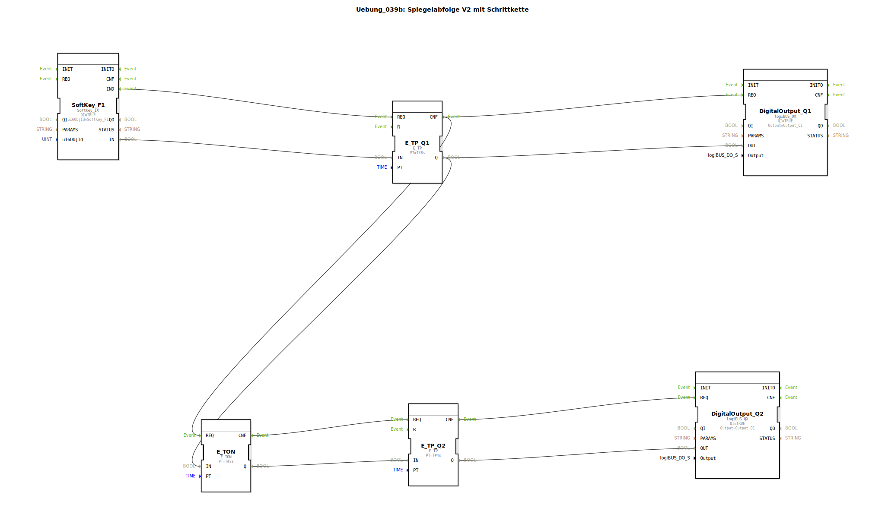

# Uebung_039b: Spiegelabfolge V2 mit Schrittkette

## Übersicht

[cite_start]In dieser Übung wird eine zeitgesteuerte Ventil-Abfolge unter Verwendung von Impulsgebern (`E_TP`) realisiert[cite: 1].

Ein Klick auf den Softkey **F1** startet eine Kette von Ereignissen:
1.  Ventil **Q1** wird für 8 Sekunden geöffnet.
2.  Nach einer Verzögerung von 2 Sekunden (`E_TON`) wird Ventil **Q2** für 4 Sekunden hinzugeschaltet.
Dies ermöglicht die Programmierung von festen hydraulischen Funktionszyklen (z.B. "Ballenauswurf"), bei denen mehrere Aktoren mit exaktem Zeitversatz arbeiten müssen.